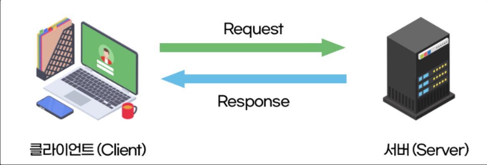
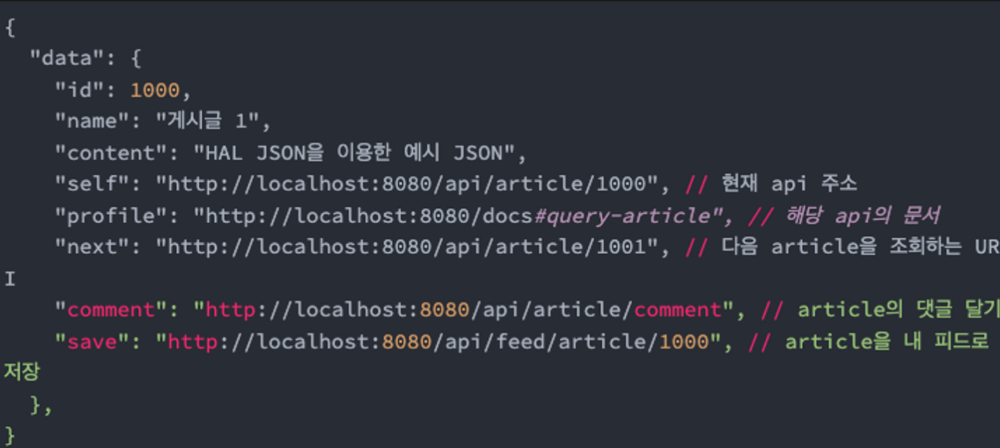
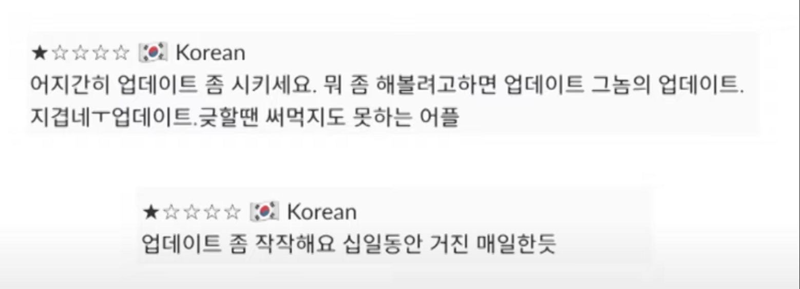
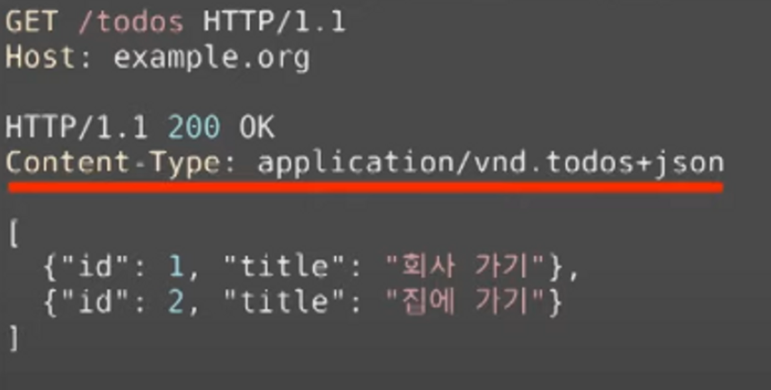
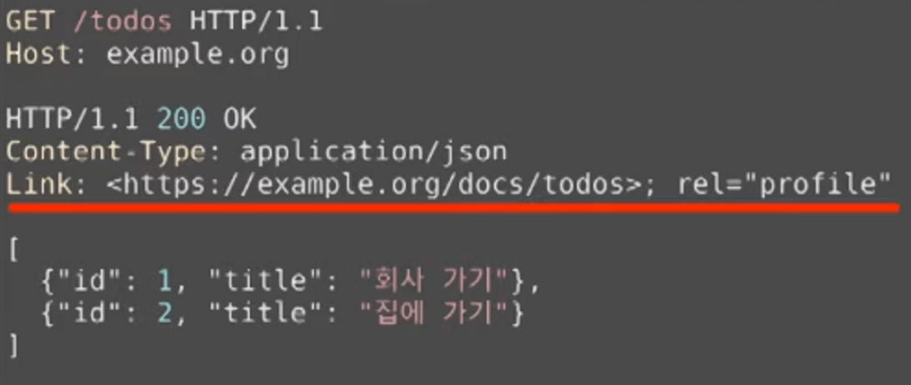
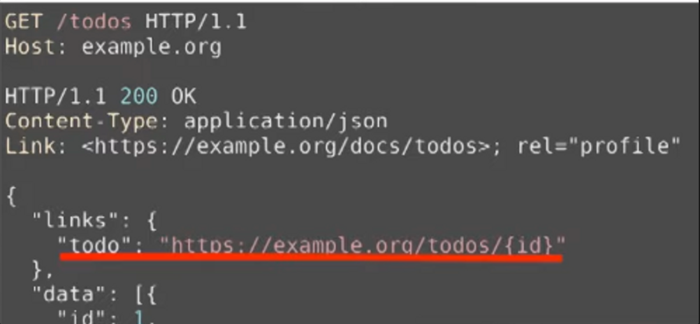
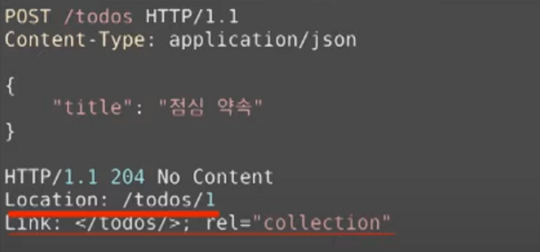

# API, REST API란

## API
df
- API 란 정보들이 주고 받아지는데에 있어서 개발자들 사이에 널리 쓰이는 일종의 형식.
- 내가 어떤 프로그래밍 언어를 쓰든, 무슨 프레임 워크를 쓰든 폼에 맞춰서 기능을 만들어내면 되는것.

인간과 소프트웨어의 소통을위한 버튼, 스크롤바, 슬라이더, 브라우저 창 같은 소프트웨어 적인 장치들을 UI 라고 하듯이 마찬가지로 기계와 기계, 소프트웨어와 소프트웨어 사이에도 요청과 정보 교환이 이루어지고 있는데 이들 사이에도 소통할 수 있는 창구가 필요하다 예를들어 서울의 버스 위치가 관리되는 서울시 교통정보과의 버스정보 서버가 있을때, 버스 도착 정보 조회와 관련된 웹 사이트, 앱들이 이 버스정보 서버로부터 실시간으로 버스정보를 요청해서 받아간다.

그렇다면 이 버스정보 서버에게 정보들을 요청하는 지정된 형식이 있어야된다.

ex) “num: 10 | date: 220910 | time: 18:30:15 | which: where” 이렇게 요청을 하면

서버가 응답으로 “suri highschool” 이라는 답이 올거라는 공개된 메뉴얼이 있으면 누구든 이걸 활용해서 버스 정보를 활용하는 소프트웨어를 만들 수 있을 것이다

이처럼 소프트웨어가 다른 소프트웨어로부터 지정된 형식으로 Request, Reponse를 할 수 있는 수단을 **Application Programming Interface(API) 라고 한다**

## REST

- Representational State Transfer의 약자, 자원을 이름으로 구분하여 해당 자원의 상태를 주고 받는 모든 것을 의미한다
- REST는 기본적으로 웹의 기존 기술과 HTTP 프로토콜을 그대로 활용하기 때문에 웹의 장점을 최대한 활용할 수 있는 아키텍처 스타일이다.
- HTTP URI 를 통해 자원을 명시하고, HTTP METHOD(POST, GET, PUT, DELETE) 를 통해 해당 자원에 대한 CRUD 연산을 적용하는 것을 의미한다
- JSON 혹은 XML 을 통해 데이터를 주고 받는 것이 일반적이다.

## REST API

프론트엔드 웹에서 서버에 데이터를 요청하거나, 배달 앱에서 서버에 주문을 넣는 등 이런 서비스들에서 오늘날 널리 사용되는 것이 REST라는 형식의 API이다.

REST의 가장 중요한 특성은 각 요청이 어떤 동작이나 정보를 위한 것인지 그 요청 모습 자체로 추론 가능하다는 것이다

예를들어서 버스 정보 웹 API 를 만들 때,

[https://도메인/1](https://도메인/1) 이 주소 끝에 1을 붙이면 리스트  버스 위치 요청

https://도메인/2 이 주소 끝에 2를 붙이면 버스 잔여 좌석 요청

[https://도메인/3](https://도메인/3) 이 주소 끝에 3을 붙이면 버스 차고지행 여부 요청

이런 식으로 짜도 서비스의 기능 자체는 아무런 문제가 없겠지만 개발은 혼자하는게 아니기 때문에 RESTful 하게 만든 API는 요청을 보내는 주소만으로도 대략 이게 뭘 하는 요청인지 파악이 가능하다.

[https://도메인/](https://도메인/1)location/10 보통 10번 버스의 위치 정보가 온다

## REST API 6원칙

1. Server-Client 구조
    - 자원이 있는 쪽이 Server, 자원을 요청하는 쪽이 Client가 된다.
        - REST Server: API를 제공하고 비지니스 로직 처리 및 저장을 담당한다.
        - Clinet: 사용자 인증이나 context(세션, 로그인 정보) 등을 직접 관리하고 책임진다
    - 브라우저 역할: 요청 → 고객은 URL 하나만 알면 서버에 있는 자료를 쓸 수 있다
    - 서버 역할: 응답
2. Stateless (무상태)
    - HTTP 프로토콜은 무상태 프로토콜 이므로 REST 또한 무상태성을 갖는다
    - Client context를 Server에 저장하지 않는다 → 세선과 쿠키같은 context 정보를 신경쓰지 않아도 되므로 구현이 단순해진다
    - Server는 각각의 요청을 완전비 별개의 것을 인식하고 처리한다
    - 즉 요청 하나만으로 자료를 가져오기 충분하도록 요청에 필요한 모든 정보들을 실어 보내야 한다

3. Cacheable(캐시 처리 가능)
    - 대량의 요청을 효율적으로 처리하기 위해 캐시가 요구된다
    - HTTP 가 가진 특징 중 하나인 캐싱 기능을 적용할 수 있다.

1. Layered System (계층화)
    - Client는 REST API Server만 호출한다
    - PROXY, 게이트웨이 같은 네트워크 기반의 중간매체를 사용할 수 있다

2. Uniform Interface(이게 제일 지키기 힘듬)
    - 하나의 URL로는 한개의 데이터만 가져와야 한다.
    - URL만 보고 어떤 정보가 들어올지 예측가능하게 한다.
    - 자기스스로 리소스가 uri를 식별하면서 표현/설명 을 한다 (self descriptive)(힘든 이유1)
        - 서버나 클라이언트가 변경되더라도 오고가는 메시지는 언제나 self-descriptive 하므로 언제나 해석이 가능하다
    - rest api가 HATEOAS 또한 만족하냐 (힘든 이유2)
    - HATEOAS 란 **Hypermedia As The Engine of Application State의 약자로**
        - 게시글을 조회하는 api 인 GET [https:*//my-server.com/article](https://my-server.com/article)*
        - 그럼 여기서 해당 글을 조회한 사용자는 다음 행동으로 어떤 행동을 할까?
            - 다음 게시물 조회
            - 게시물을 내 피드에 저장
            - 댓글 달기
        - 이런 행동들이 바로 상태 전이가 가능한 것들인데, 이 것들을 응답 본문에 넣어줘야 한다는 소리이다.(Hypermedia (링크)를 통해서 넣는다.)
          - 또한 링크는 동적으로 변경될 수 있다
            
6. Code on Demand(Optional)
   - 서버는 클라이언트에게 실제 실행 가능한 코드를 전송가능 하다

## REST API 특징

- 확장성과 재사용성을 높여 유지보수 및 운용을 편리하게 할 수 있다
- REST는 HTTP 표준을 기반으로 구현하므로, HTTP를 지원하는 프로그램 언어로 클라이언트, 서버를 구현할 수 있다
- REST API 메세지가 의도하는 바를 명확하게 나타내므로 의도하는 바를 쉽게 파악할 수 있다
- 서버와 클라이언트의 역할을 명확하게 분리한다

## REST API 설계 규칙

- 슬래시(/)는 계층 관계를 나타내는데 사용한다
- 마지막 문자로 슬래시(/)를 사용하지 않는다 URI는 리소스의 유일한 식별자로 사용되어야하기 때문에, 슬래시를 붙인 것과 안 붙인것의 차이가 명확하므로 괜한 혼동을 일으키지 않기 위해 슬래시를 마지막에 사용하지 않습니다.
- 하이픈(-) 은 URI 가독성을 높이는데 사용합니다
- 밑줄(_) 은 가독성을 위해 사용하지 않습니다
- URI 경로에는 소문자를 사용합니다
- 파일 확장자는 포함하지 않습니다.

공지사항 간단한 예시

n번째 공지사항 조회→ [GET] /notices/{n}

생성→ [POST] /notices    (공지사항은 메시지 바디에)

n번째 공지사항 수정(대체)→ [PUT] /notices/{n}    (공지사항은 메시지 바디에)

n번째 공지사항 수정(부분 번경) → [PATCH] /notices/{n}     (공지사항은 메시지 바디에)

n번째 공지사항 삭제→ [DELETE] /notices/{n}

## 그래서 왜 REST API 를 사용해야 하는가

### 독립적 진화

- 서버와 클라이언트가 각각 독립적으로 진화한다.
- 서버의 기능이 변경되어도 클라이언트를 업데이트할 필요가 없다.

## 실제로 REST API 가 잘 지켜지고 있는가

### 웹(chrome, safari, firefox)

- 웹 페이지를 변경했다고 웹 브라우저를 업데이트할 필요 없다
- 웹 브라우저를 업데이트했다고 웹 페이지를 변경할 필요도 없다.
- HTTP 명세가 변경되어도 웹은 잘 동작한다(HTTP/0.9 아직도 지원함)
- HTML 명세가 변경되어도 웹은 잘 동작한다(브라우저가 너무 옛날 브라우저면 살짝 깨질 수 있다 그래도 동작은 한다)

### 앱

- 앱이 강제 업데이트 하는 경우 → 서버의 기능이 변경 되었는데 클라이언트가 지원해주는데 한계가 있다 업데이트를 해야 한다
- 엄밀히 말하면 모바일 클라이언트와 서버가 REST 로 통신하고 있지 않다

## 저 6원칙을 지키면서 꼭 REST API 로 개발해야 하는가

시스템 전체를 통제할 수 있다고 생각하거나, 진화에 관심이 없다면, REST에 대해 따지느라 시간을 낭비하지 마라 

-Roy T.Fielding-

## 실제로 어려운 self-descriptive 적용하려면?

### 1. Media type

1. 미디어 타입을 하나 정의한다
2. 미디어 타입 문서를 작성한다. 이 문서에 id 가 뭐고 title 이 뭔지 의미를 정의한다
3. IANA 에 미디어 타입을 등록한다. 이 때 만든 문서를 미디어 타입의 명세로 등록한다
4. 이제 이 메시지를 보는 사람은 명세를 찾아갈 수 있으므로 이 메시지의 의미를 온전히 해석할 수 있다

### 2. Profile

1. id 가 뭐고 title 이 뭔지 의미를 정의한 명세를 작성한다.
2. Link 헤더에 profile relation 으로 해당 명세를 링크한다
3. 이제 메시지를 보는 사람은 명세를 찾아갈 수 있으므로 이 문서의 의미를 온전히 해석할 수 있다

## 실제로 어려운 HATEOAS 를 적용하려면?

### 1. data

data에 다양한 방법으로 하이퍼링크를 포현한다

### 2. HATEOAS

Link, Location 등의 헤더로 링크를 표현한다

출처 - https://www.youtube.com/watch?v=RP_f5dMoHFc