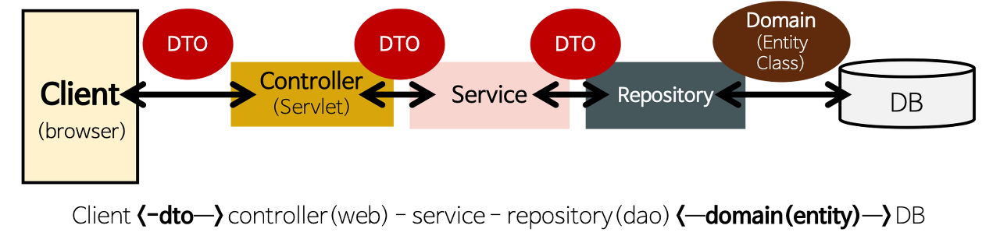

# [1주차] Spring Web Layer

복습: No
작성일시: 2023년 4월 13일 오후 8:19

# 01 Spring의 레이어드 아키텍쳐

- 스프링 부트는 별도의 설정 없이 spring-boot-starter-web의 의존성을 사용할 때는 기본적으로 스프링 MVC 구조를 띠게 되며, 위와 같은 아키텍처를 이룸

## 1. 프레젠이션 계층(웹계층)

- 클라이언트로부터 데이터와 함께 요청을 받고 처리 결과를 응답으로 전달하는 역할
- 서비스계층, 데이터 엑세스 계층에서 발생하는 Exception을 처리
- @Controller 어노테이션을 사용하여 작성된 Controller 클래스가 이 계층에 속함

## 2. 서비스 계층(비지니스 계층)

- 핵심 비즈니스 로직을 구현하는 영역
- 트랜잭션 처리나 유효성 검사 등의 작업도 수행
- 웹 계층과 레포지토리 계층 사이를 연결하는 역할로서 두 계층이 직접적으로 통신하지 않게 함
- Service 인터페이스와 @Service 어노테이션을 사용하여 작성된 Service 구현 클래스가 이 계층에 속함

## 3. 레포지토리 계층(데이터 엑세스 계층)

- 데이터베이스에 접근해야하는 작업을 수행
- ORM(Mybatis, Hibernate)를 주로 사용하는 계층
- 데이터베이스에 접근해야 하는 작업을 수행 → (CRUD 수행)
- DAO 인터페이스와 @Repository 어노테이션을 사용하여 작성된 DAO 구현 클래스가 이 계층에 속함

## 4. 도메인 모델 계층

- DB의 테이블과 매칭될 클래스
- Entity 클래스라고도 불림
- 다만, 무조건 데이터베이스의 테이블과 관계가 있어야 하는 것은 아님
- 도메인 모델은 아키텍처 상의 도메인 계층을 객체 지향 기법으로 구현하는 패턴을 말함
    - **핵심 규칙을 구현한 코드는 도메인 모델에만 위치**하기 때문에 규칙이 바뀌거나 규칙을 확장할 때 다른 코드에 영향을 덜 주고 변경 내역을 모델에만 반영할 수 있게 된다.

> `**'도메인 모델'**`이란 용어는 도메인 자체를 표현하는 개념적인 모델을 의미하지만,
*도메인 계층을 구현할 때 사용하는 객체 모델을 언급할 때*에도 '도메인 모델'이란 용어를 사용한다.
> 

### 1) DTO(Data Tranfer Object)

- 각 계층간 데이터 교환을 위한 객체 → 데이터를 주고 받을 포맷
    
    **[ 클라이언트에서 서버쪽으로 전송하는 요청 데이터 ]**
    
    **[서버에서 클라이언트 쪽으로 전송하는 응답 데이터 ] 의 형식으로 클라이언트와 서버 간에 데이터 전송이 이루어짐.**
    
- DB에서 데이터를 얻어 Service, Controller 등으로 보낼 때 사용함
    - 예를 들어 뷰 템플릿 엔진에서 사용될 객체나 Repository Layer에서 결과로 넘겨준 객체 등
- 로직을 갖고 있지 않는 순수한 데이터 객체이며, getter/setter 메서드 사용

<aside>
📌 **DTO vs VO**

- VO는 DTO와 동일한 개념이지만 read only 속성을 갖는다
→ VO는 값을 변경할 수 없게 만들어 데이터의 신뢰성 유지
- DTO는 데이터 전송을 위해 사용되는 데이터 컨테이너
- 즉, VO는 특정한 비즈니스 값을 담는 객체이고, DTO는 Layer간의 통신 용도로 오고가는 객체
</aside>

<aside>
📌 **DTO를 사용하는 이유**  
    
**1) 클라이언트의 데이터를 이용하기 쉽도록 하기 위해**
→ 도메인 모델은 애플리케이션의 내부 모델인데, 외부에 노출시킨다면 클라이언트는 내부 모델을 알지 못하는 상태에서 사용을 해야한다. DTO를 통해 클라이언트에게 모델을 숨기고 더 사용하기 쉬운 API를 제공하는 것이 좋다.

**2) 유지 보수**  
→ 도메인 모델이 외부에 노출될 시 추후 도메인 모델을 변경할 때 도메인 모델에 의존하는 것들을 모두 변경해야하지만, DTO를 사용하면 도메인 모델을 쉽게 변경할 수 있다.

</aside>

### 2) DAO(Data Access Object)

- 실제로 DB에 접근하는 객체
- Service와 DB를 연결하는 고리의 역할을 한다.
- SQL를 사용(개발자가 직접 코딩)하여 DB에 접근한 후 적절한 CRUD API를 제공한다.
    - JPA 대부분의 기본적인 CRUD method를 제공하고 있다.

