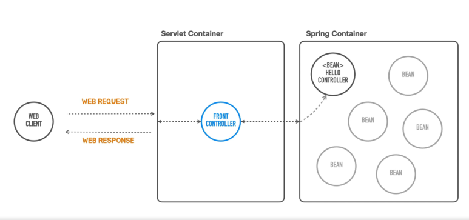

# Spring과 Spring boot 차이

# Spring framework란?

**자바 엔터프라이즈 개발을 편하게 해주는 오픈 소스 경량급 애플리케이션 프레임워크**

- 엔터프라이즈 개발
    
     기업을 대상으로 하는 개발이라는 말입니다. 즉, 대규모 데이터 처리와 트랜잭션이 동시에 여러 사용자로 부터 행해지는 매우 큰 규모의 환경
    
- 오픈 소스 경량급
    
    누구나 수정가능한 오픈소스를 쉽게 이용가능
    

## 특징

1. IOC (제어의 역전)
2. DI (의존성 주입)
3. AOP (관점 지향 프로그래밍)

### IOC (제어의 역전)

일반적인 프로그램

```java
public class Professor {

    private Math math;

    public Professor() {
        this.math = new Math();
    }

    public void work() {
        System.out.println("수업을 하겠다.");
				this.math.teach();
    }

}

public class Math {
    public void teach() {
        System.out.println("수학책 펴라.");
    }
}

// 필요한 쪽에서 객체를 생성하고, 객체의 메서드를 호출
```

의존관계를 역전시킨 프로그램(어디까지나 IOC를 비유로 통한 예시로, 추상화 == 의존관계역전 은 아닙니다!)

```java
interface Lecture {
	void teach();
}

public class Math implements Lecture {
	public void teach() {
		System.out.println("수학책 펴라");
	}
}

public class Professor {
	private Lecture lecture

	public void setLecture(Lecture lecture) {
		this.lecture = lecture;
	}

	public void work() {
		System.out.println("수업을 하겠다");
		this.lecture.teach();
	}
}

```

### DI (의존성 주입)

DI는 IOC를 구현하기 위해 사용하는 패턴이다. 

@Autowired 등장 전에는 xml 파일이나 @Configuration 파일에 bean을 등록하면서 의존관계를 설정하는 방법으로 구현했다.

- 필드 주입

```java
@Transactional
@Service
public class CategoryService {
	@Autowired
	private CategoryRepository categoryRepository;

	public void createCategory() {
		Category save = categoryRepository.save(new Category());
	}
}
```

- setter 주입

```java
@Transactional
@Service
public class CategoryService {
	
	private CategoryRepository categoryRepository;

	@Autowired
	public void setCategoryServicce() {
		this.categoryRepository = categoryRepository;
	}
}
```

- 생성자 주입

```java
@Transactional
@Service
public class CategoryService {

	// final 붙이기 가능
	private final CategoryRepository categoryRepository;

	@Autowired
	public CategoryService(CategoryRepository categoryRepository) {
		this.categoryRepository = categoryRepository;
	}
}

@RequiredArgsConstructor
@Transactional
@Service
public class CategoryService {
	private final CategoryRepository categoryRepository;
}
```

### AOP (관점 지향 프로그래밍)

애플리케이션 로직에는 크게 2가지 기능이 있다.

- 핵심 기능
- 부가 기능

부가 기능은 말 그대로 핵심 기능을 보조하기 위해 존재한다.  보통 부가 기능은 여러 클래스에서 걸쳐서 함께 사용된다. 즉, 클래스가 100개면 100개 모두 동일한 코드를 추가해야한다.

이를 해결하기 위해서 부가기능을 핵심 기능에서 분리하고 한 곳에서 관리하도록 했다.

그리고 해당 부가 기능(advice)을 어디에 적용할지(pointcut) 선택하는 기능을 만들고 이 것들을 합해서 하나의 모듈로 만든것이 Aspect(advice + pointcut).

Aspect를 사용한 프로그래밍 방식을 관점 지향 프로그래밍 이라고 한다.

```java
@Component
@Aspect
public class CustomValidationAdvice {

    @Pointcut("@annotation(org.springframework.web.bind.annotation.PostMapping)")
    public void postMapping() {

    }
    @Pointcut("@annotation(org.springframework.web.bind.annotation.PutMapping)")
    public void putMapping() {

    }

		// joinPoint : aop를 적용할 타켓 메서드
    @Around("postMapping() || putMapping()")
    public Object validationAdvice(ProceedingJoinPoint proceedingJoinPoint) throws Throwable {
        Object[] args = proceedingJoinPoint.getArgs();
        for (Object arg : args) {
            if (arg instanceof BindingResult) {
                BindingResult bindingResult = (BindingResult) arg;

                if (bindingResult.hasErrors()) {
                    Map<String, String> errorMap = new HashMap<>();
                    for (FieldError error : bindingResult.getFieldErrors()) {
                        errorMap.put(error.getField(), error.getDefaultMessage());
                    }

                    throw new CustomValidationException("유효성검사 실패", errorMap);
                }
            }

        }
        return proceedingJoinPoint.proceed();
    }

}
```

# Spring boot란?



# Spring vs Spring boot

Spring : 문맥에 따라 여러 뜻으로 쓰인다. (스프링 DI 컨테이너, 스프링 프레임워크, 스프링 생태계)

Spring boot : 스프링을 기반으로 실무 환경에 사용 가능한  수준의 독립실행형 애플리케이션을

복잡한 고민 없이 빠르게 작성할 수 있게 도와주는 여러가지 도구의 모음이다.