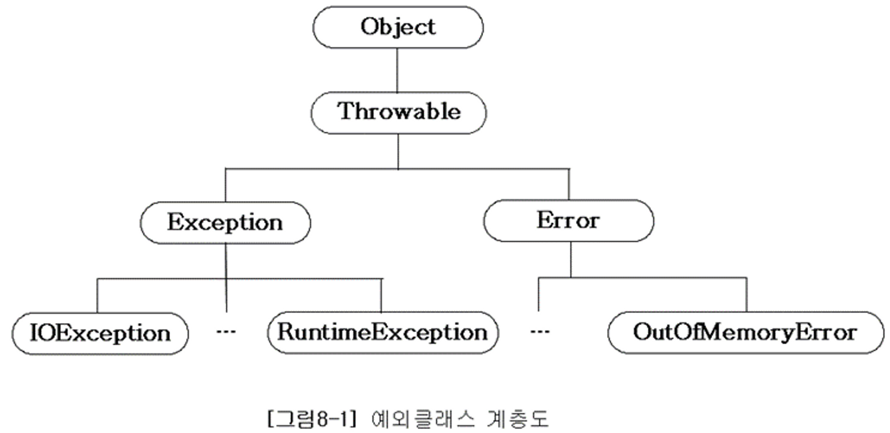
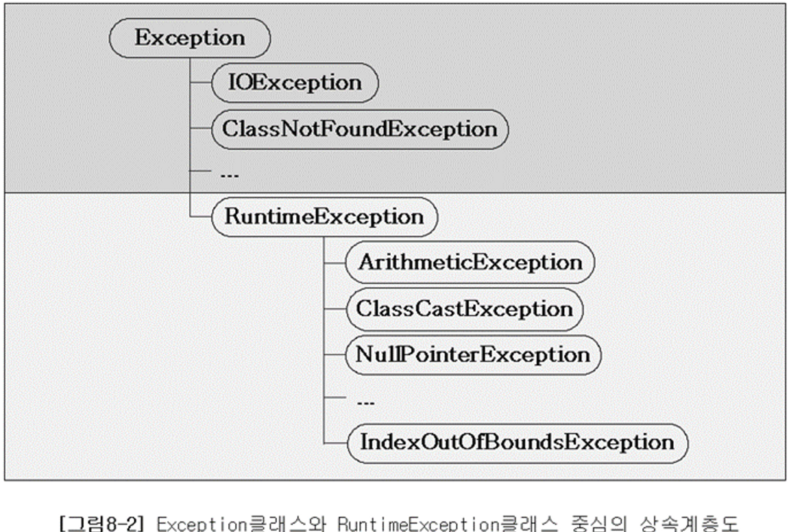

# 예외처리 (Exception handling)

## 1. 프로그램 오류

프로그램이 실행 중 어떤 원인에 의해서 오작동을 하거나 비정상적으로 종료되는 경우가 있다. 이러한 결과를 초래하는 원인을 프로그램 에러 또는 오류라고 한다.

발생 시점에 따라 컴파일 에러 와 런타임 에러 로 나눌 수 있다

- 컴파일 에러: 컴파일 할 때 발생하는 에러 → 컴파일러가 .java 파일에 대해 오타나 잘못된 구문, 자료형 체크 등의 기본적인 검사를 수행하여 오류가 있는지 컴파일 시점에 알려준다
- 런타임 에러: 프로그램의 실행 도중에 발생하는 에러 → 컴파일 에러가 없으면 프로그램 실행 중 발생할 수 있는 잠재적인 오류 ex) 프로그램이 실행중 동작이 멈추거나, 실행을 멈추고 지 맘대로 종료하는 경우
- 논리적 에러: 실행은 되지만 의도와 다르게 동작하는 것 ex) 계좌의 잔액이 음수가 되는 것

에러가 발생하면, 프로그램의 비정상적인 종료를 막을 길이 없지만 예외는 발생하더라도 프로그래머가 이해 대한 적절한 코드를 미리 작성해 놓음으로써 프로그램의 비정상적인 종료를 막을 수 있다.

## 2. 예외 클래스의 계층 구조

자바에서는 실행 시 발생할 수 있는 오류를 클래스로 정의하였다. 앞에서 배운 것처럼 모든 클래스의 조상은 Object 클래스이므로 Exception과 Error클래스 역시 Object 클래스의 자손들이다



모든 예외의 최고 조상은 Exception 클래스이며 상속 계층도를 Exception 클래스로부터 도식화하면 다음과 같다



위 상속 계층도를 두 그룹으로 나눈다

- Exception 클래스와 그 자손들 (이하 Exception 클래스들) → 사용자의 실수같은 외적인 요인에 의해 발생되는 예외 ex) FileNotFoundException, ClassNotFoundException
- RuntimeException 클래스와 그 자손들 (이하 RuntimeException 클래스들) → 프로그래머의 실수에 의해 발생될 수 있는 예외 ex) NullPointerException

## 3. 예외 처리하기

프로그램 실행도중 발생하는 에러는 어쩔 수 없지만 예외는 프로그래머가 이에 대한 처리를 미리 해주어야 한다

예외처리란 프로그램 실행 시 발생할 수 있는 예기치 못한 예외의 발생에 대비한 코드를 작성하는 것이며, 예외처리의 목적은 예외의 발생으로 인한 실행 중인 프로그램의 갑작스런 비정상 종료를 막고 정상적인 실행상태를 유지할 수 있도록 하는 것이다

발생한 예외를 처리하지 못하면 프로그램은 비정상적으로 종료되며 처리되지 못한 예외는 JVM의 예외처리기(UncaughtExceptionHandler)가 받아서 예외의 원인을 화면에 출력한다

```java
try{
            //예외가 발생할 가능성이 있는 코드
} catch (Exception1 e1) {
            //Exception1 이 발생했을 경우 이를 처리하기 위한 코드
} catch (Exception2 e2) {
            //Exception2 이 발생했을 경우 이를 처리하기 위한 코드
} catch (Exception3 e3) {
            //Exception3 이 발생했을 경우 이를 처리하기 위한 코드
}
```

이 중 발생한 예외의 종류와 일치하는 단 한개의 catch 블럭만 수행된다

```java
public static void method() {
        
        int num = 100;
        int result = 0;
        for(int i = 0; i < 10; i++) {
            result = num / (int)(Math.random() * 10);
            System.out.println(result);
        }
        
}
```

0으로 나누게 되면 ArithmeticException 이 발생

```java
public static void method() {

        int num = 100;
        int result = 0;
        for(int i = 0; i < 10; i++) {
            try {
                result = num / (int)(Math.random() * 10);
                System.out.println(result);
            } catch (ArithmeticException e) {
                System.out.println("0");
            }
        }
}
```

이렇게 처리해 주면 된다 만일 예외 처리를 하지 않는다면 0을 만나면 프로그램이 비정상적으로 종료된다

printStackTrace(): 예외발생 당시의 호출스택에 있었던 메서드의 정보와 예외 메시지를 화면에 출력한다

ex) java.lang.ArithmeticException: /by zero at ExceptionEx8.(mainExceptionEx8.java7)

getMessage(): 발생한 예외클래스의 인스턴스에 저장된 메시지를 얻을 수 있다.

ex) / by zero

```java
try{
            //예외가 발생할 가능성이 있는 코드
} catch (Exception1 e1) {
            //Exception1 이 발생했을 경우 이를 처리하기 위한 코드
} catch (Exception2 e2) {
            //Exception2 이 발생했을 경우 이를 처리하기 위한 코드
}
```

이 코드를 멀티 catch 블럭을 사용하면

```java
try{
            //예외가 발생할 가능성이 있는 코드
} catch (Exception1 e1 | Exception2 e2)) {

} 
```

이렇게 가능하다 만약에 | 기호로 연결된 예외 클래스가 조상과 자손의 관계에 있다면 컴파일 에러가 발생한다

그냥 조상예외로 하나로 퉁치라는 뜻

## 4. 예외 발생시키기

```java
Exception e = new Exception("고의로 발생시킴");
throw e;
```

```java
try{
	Exception e = new Exception("고의로 발생시킴");
	throw e;
} catch (Exception e) {
	System.out.println(e.getMessage())
}
```

이렇게 하면 결과는

고의로 발생시킴 이라는 결과가 된다

```java
class Test {

    public static void main(String[] args) {
        throw new Exception();
    }
}
```

이건 어캐될까 이건 컴파일 에러가 된다 예외처리가 되어야 할 부분에 예외처리가 되어 있지 않다는 에러가 뜬다

Exception클래스들이 발생할 가능성이 있는 코드들에 대해 예외처리를 해주지 않으면 컴파일조차 되지 않는다.

```java
class Test {

    public static void main(String[] args) {
        throw new RuntimeException();
    }
}
```

이건 어캐될까 성공적으로 컴파일 된다 하지만 RuntimeExeption 이 발생하여 비 정상적으로 종료되긴 한다

RuntimeException 클래스들은 프로그래머의 실수로 발생하는 것들이기 때문에 예외처리를 강제하지 않는다

그래서 RuntimeExecption 클래스들은 unchecked 예외 라고 부르고

Exception 클래스들은 checked 예외 라고 부른다

## 5. 메서드에 예외 선언하기

```java
void method() throws Exception1, Exception2 {
}
```

메서드의 선언부에 예외를 선엄함으로써 메서드를 사용하려는 사람이 메서드의 선언부를 보았을 때, 이 메서드를 사용하기 위해서는 어떠한 예외들이 처리되어져야 하는지 쉽게 알 수 있다

이 메서드를 사용하는 쪽에서는 이에 대한 처리를 하도록 강요하기 때문에 프로그래머들의 짐을 덜어주고 견고한 코드를 작성할 수 있게 도와준다

정확히는 자신을 호출한 메서드에게 예외를 전달하여 예외처리를 떠맡기는 것이다

```java
class Test {
    public static void main(String[] args) throws Exception{
        method1();
    }

    private static void method1() throws Exception {
        method2();
    }

    private static void method2() throws Exception {
        throw new Exception();
    }
}
```

```
Exception in thread "main" java.lang.Exception
	at codeplus.algorithm_basic.bruteforce.Test.method2(OverridingTest.java:42)
	at codeplus.algorithm_basic.bruteforce.Test.method1(OverridingTest.java:38)
	at codeplus.algorithm_basic.bruteforce.Test.main(OverridingTest.java:34)
```

method2 에서 Exception 문장에 의해 예외가 발생했으나 try catch문이 없어서 method2는 종료되고 자신을 호출한 method1에게 예외를 넘겨준다 method1역시 이 방식으로 main에 예외를 넘긴다 main에서도 예외처리를 하지 않았기 때문에 프로그램은 종료된다 단순히 예외처리를 하지 않고 자신을 호출한 메서드에게 예외를 전달해주는거다 어느 한 곳에서는 반드시 예외처리를 해주어야 한다

## 6. finally

finally는 예외의 발생여부에 상관없이 실행되어야 할 코드를 포함시킬 목적으로 사용된다

```java
try{
            //예외가 발생할 가능성이 있는 코드
} catch (Exception1 e1) {
            //Exception1 이 발생했을 경우 이를 처리하기 위한 코드
} finally {
						//예외의 발생여부에 관계없이 항상 수행되어야하는 코드
}
```

```java
class Test {
    public static void main(String[] args) {
        try{
            startInstall(); //설치
            copyFile(); //복사
            deleteTmpFile(); //복사에 사용한 임시파일 삭제
        } catch(Exception e) {
            e.priontStackTrace();
            deleteTmpFile(); //복사에 사용한 임시파일 삭제
        }
    }
}
```

결국엔 예외가 터지든 말든 복사에 사용한 임시파일은 삭제해야되는 코드니까

```java
class Test {
    public static void main(String[] args) {
        try{
            startInstall(); //설치
            copyFile(); //복사
        } catch(Exception e) {
            e.priontStackTrace();
        } finally {
            deleteTmpFile(); //복사에 사용한 임시파일 삭제
			}
    }
}
```

이런 식이다

```java
class Test {
    public static void main(String[] args) {
        try{
            startInstall(); //설치
            copyFile(); //복사
						return;
        } catch(Exception e) {
            e.priontStackTrace();
        } finally {
            deleteTmpFile(); //복사에 사용한 임시파일 삭제
			}
    }
}
```

이렇게 해도 deleteTmpFile()은 실행 된다

[ControllerAdvice](https://www.notion.so/ControllerAdvice-e84a18ab211d4d0cacdbac13d512cd18?pvs=21)