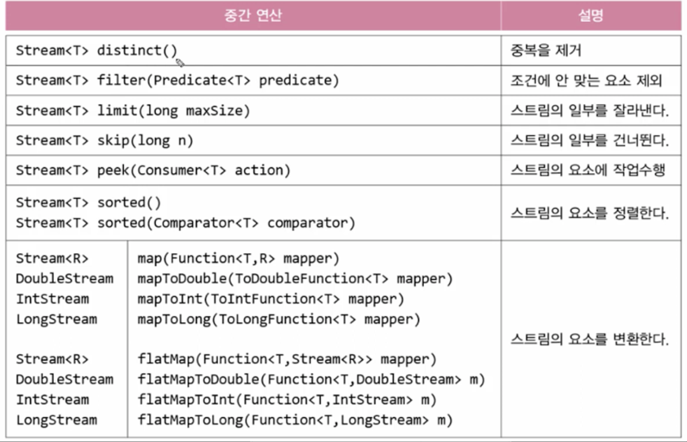
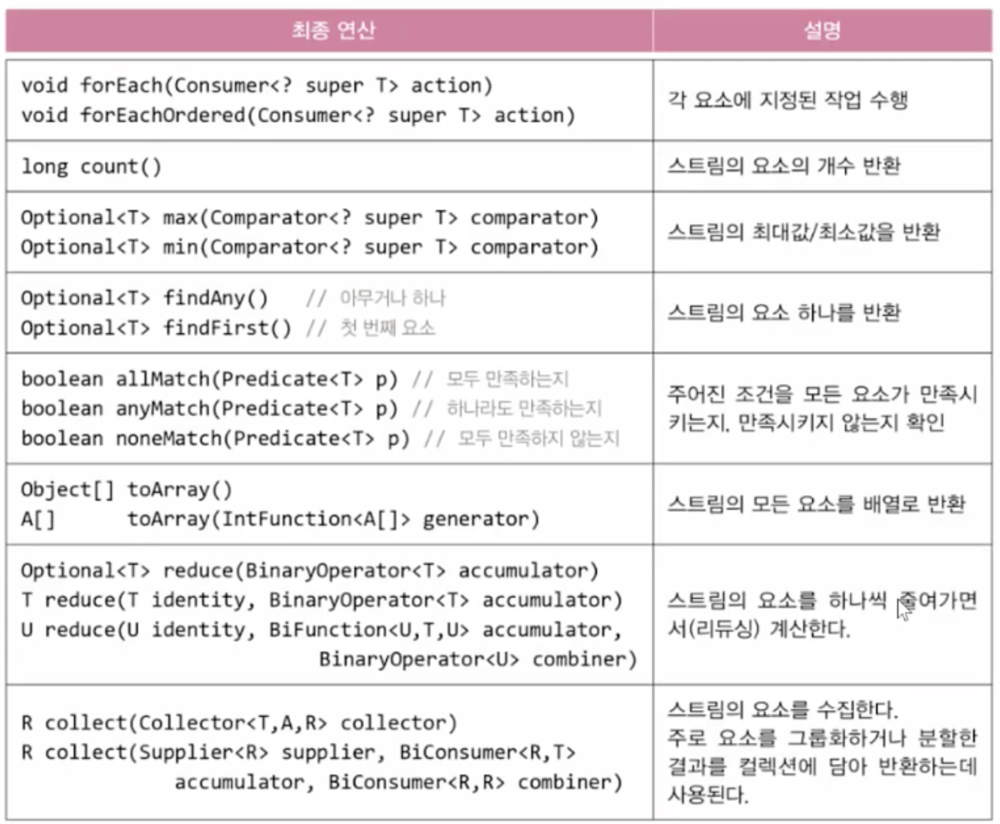

# 스트림(stream)

## 1. 스트림이란?

컬렉션이나 배열에 데이터를 담고 원하는 결과를 얻기 위해 for문과 Iterator를 이용해서 코드를 작성해왔다 그러나 이런 방식으로는 너무 길고 알아보기 어렵고 재사용성도 떨어진다

그리고 데이터 소스마다 다른 방식으로 다뤄야 한다는 것이다 Collection이나 Iterator와 같은 인터페이스를 이용해서 컬렉션을 다루는 방식을 표준화하기는 했지만, 각 컬렉션 클래스에는 같은 기능의 메서드들의 중복해서 정의되어 있다 예를 들어 List를 정렬할 때는 Collections.sort()를 사용해야 하고 배열을 정렬할 때는 Arrays.sort()를 사용해야 한다

이러한 문제점을 해결하기 위해서 만든것이 스트림이다 스트림은 데이터 소스를 추상화하고 데이터를 다루는데 자주 사용되는 메서드들을 정의해 놓았다. 데이터 소스를 추상화했다는 것은 데이터 소스가 무엇이던 간에 같은방식으로 다룰 수 있게 되었다는 것과 코드의 재사용성이 높아진다는 것을 의미한다

문자열 배열과 같은 내용의 문자열을 저장하는 List가 있다

```java
String[] strArr = {"aaa", "bbb", "ccc"};
List<String> strList = Arrays.asList(strArr);
```

이 두 데이터를 스트림은 이렇게 생성한다

```java
Stream<String> strStream1 = strList.stream();
Stream<String> strStream2 = Arrays.stream();
```

이 데이터들을 출력하려면

```java
strStream1.forEach(System.out::println);
strStream2.forEach(System.out::println);
```

이렇게 코드가 간결해진다

### 스트림은 데이터 소스를 변경하지 않는다

데이터를 읽기만 할 뿐 데이터를 변경하지 않는다 정렬된 결과를 컬렉션이나 배열에 담아서 반환할 수는 있다

List<String> sortedList = strStream2.sorted().collect(Collectors.toList());

### 스트림은 일회용이다

스트림은 Iterator처럼 일회용이다 Iterator로 컬렉션의 요소를 모두 읽고 나면 다시 사요할 수 없는 것처럼 스트림도 한번 사용하면 닫혀서 다시 사용할 수 없다

```java
strStream1.sorted().forEach(System.out::println);
int numOfStr = strStream1.count() // 에러 스트림이 이미 닫힘
```

### 스트림은 작업을 내부 반복으로 처리한다

스트림을 이용한 작업이 간결할 수 있는 비결중의 하나가 바로 ‘내부 반복’ 이다 내부 반복이라는 것은 반복문을 메서드의 내부에 숨길 수 있다는 것을 의미한다. forEach()는 스트림에 정의된 메서드 중의 하나로 매개변수에 대입된 람다식을 데이터 소스에 모든 요소에 적용한다

### 스트림의 연산

스트림이 제공하는 다양한 연산을 이용하여 복잡한 작업들을 간단히 처리할 수 있다. 마치 데이터베이스에 SELECT 쓰는 것과 같은 느낌이다

스트림의 연산은 중간 연산과 최종 연산으로 분류할 수 있는데, 중간 연산은 연산결과를 스트림으로 반환하기 때문에 중간 연산을 연속해서 연결할 수 있다. 반면에 최종 연산은 스트림의 요소를 소모하면서 연산을 수행하므로 단 한번만 연산이 가능하다
```java
stream.distinct().limit(5).sorted().forEach(System.out::println)
```




### 지연된 연산

최종 연산이 수행되기 전까지는 중간 연산이 수행되지 않는다는 것이다 중간 연산을 호출하는 것은 단지 어떤 작업이 수행되어야 하는지를 지정해주는 것일 뿐이다 최종 연산이 수행되어야 비로소 스트림의 요소들이 중간 연산을 거쳐 최종 연산에서 소모된다.

### 병렬 스트림

스트림으로 데이터를 다룰 때 병렬 처리가 쉽다 내부적으로 fork&join 프레임워크를 사용하여 자동적으로 연산을 병렬로 수행한다 스트림에 parallel() 메서드 호출, 병렬 싫으면 sequential() 호출하면 된다

```java
int sum = strStream.parallel()
									 .mapToInt(s -> s.length())
									 .sum();
```

## 2. 스트림 만들기

### 컬렉션

컬렉션의 최고 조상이 Collection에 stream이 정의되어 있다. 그래서 Collection의 자손인 List와 Set을 구현한 컬렉션 클래스들은 모두 이 메서드로 스트림을 생성할 수 있다.

```java
Stream<T> Collection.stream(); // stream()은 해당 컬렉션을 소스로 하는 스트림을 반환한다

List<Integer> list = Arrays.asList(1, 2, 3, 4, 5);
Stream<Integer> intStream = list.stream(); //list를 소스로하는 컬렉션 생성
```

### 배열

```java
Stream<String> strStream = Stream.of("a", "b", "c");
Stream<String> strStream = Stream.of(new String[] {"a", "b", "c"});
Stream<String> strStream = Arrays.Stream(new String[] {"a", "b", "c"});

```

### 특정 범위의 정수

지정된 범위의 연속된 정수를 스트림으로 생성해서 반환

```java
IntStream intStream = IntStream.range(1, 5) //1, 2, 3, 4
IntStream intStream = IntStream.rangeClosed(1, 5) //1, 2, 3, 4, 5
```

### 두 스트림의 연결

```java
String[] str1 = {"1", "2", "3"};
String[] str2 = {"a", "b", "c"};

Stream<String> stream1 = Stream.of(str1);
Stream<String> stream2 = Stream.of(str2);

Stream<String> stream3 = Stream.concat(stream1, stream2);
```

## 3. 스트림의 중간 연산

### 스트림 자르기 - skip(), limit()

skip(3)은 처음 3개의 요소를 건너뛰고, limit(5)는 스트림의 요소를 5개로 제한한다

```java
IntStream intStream = IntStream.rangeClosed(1, 10); //1~10의 요소를 가진 스트림
intStream.skip(3).limit(5).forEachSystem.out::println() // 45678
```

### 스트림의 요소 걸러내기 - filter(), distinct()

distinct()는 스트림에서 중복된 요소들을 제거하고, filter()는 주어진 조건(Predicate)에 맞지 않는 요소를 걸러낸다

```java
IntStream intStream = IntStream.of(1, 2, 2, 3, 3, 4, 4, 5, 6, 6)
intStream.distinct().forEach(System.out::print); //123456
```

filter()는 매개변수로 Predicate를 필요로 하는데 아래와 같이 연산결과가 boolean 인 람다식을 사용해도 된다

```java
IntStream intStream = IntStream.rangeClosed(1, 10); //1~10의 요소를 가진 스트림
intStream.filter(i -> i%2 == 0).forEach(System.out::println); 246810
```

### 정렬 - sorted()

```java
Stream<String> stream1 = Stream.of("dd", "aaa", "CC", "cc", "b");
stream1.sorted().forEach(System.out::println); //CCaaabccdd

Stream<T> sorted(Comparator<? super T> comparator);
stream1.sorted((s1, s2) -> s1.compareTo(s2));
stream1.sorted(String::compareTo); // 위 식과 동일
```

위 Comparator를 지정할 때 int값을 반환하는 람다식을 사용하는 것도 가능하다

정렬 조건을 추가할땐 thenComparing 사용하면 된다

학생 스트림을 반, 성적, 이름 순으로 정렬하려면

```java
studentStream.sorted(Comparator.comparing(Student::getBan)
												   .thenComparing(Student::getTotalScore)
												   .thenComparing(Student::getName)
													 .forEach(System.out::println);
```

### 변환 - map()

스트림의 요소에 저장된 값 중에서 원하는 필드만 뽑아내거나 특정 형태로 변환해야 할 때가 있다. 이 때 사용하는 것이 바로 map()이다

```java
Stream<R> map(Function<? super T, ? extends R> mapper)
```

예를들어 File의 스트림에서 파일의 이름만 뽑아서 출력하고 싶을 때

```java
Stream<File> fileStream = Stream.of(new File("Ex1.java"), new File("Ex1"),
					new File("Ex1.bak"), new File("Ex2.java"));

Stream<String> filenameStream = fileStream.map(File::getName);
```

이걸 응용하면

```java
filterStream.map(File::getName) //Stream<File> -> Stream<String>
	.filter(s -> s.indexOf('.') != -1) // 확장자 없는거 제외
	.map(s -> s.substring(s.indexOf('.') + 1)) //확장자만 추출
	.map(String::toUpperCase) // 모두 대문자로 변환
	.distinct() // 중복 제거
	.forEach(System.out::print);
```

### 조회 - peek()

연산과 연산 사이에 올바르게 처리되었는지 확인하고 싶다면 peek()를 사용하자 forEach()와 같이 스트림의 요소를 소모하지 않으므로 연산 사이에 여러 번 끼워 넣어도 문제가 되지 않는다

```java
filterStream.map(File::getName) //Stream<File> -> Stream<String>
	.filter(s -> s.indexOf('.') != -1) // 확장자 없는거 제외
	.peek(s -> System.out.println("filename = " + s)
	.map(s -> s.substring(s.indexOf('.') + 1)) //Stream<String> -> Stream<String>
	.map(String::toUpperCase) // 모두 대문자로 변환
	.distinct() // 중복 제거
	.forEach(System.out::print);
```

## 4. 스트림의 최종 연산

최종 연산은 스트림의 요소를 소모해서 겨로가를 만들어낸다 그래서 최종 연산 후에는 스트림이 닫히게 되고 더이상 사용할 수 없다. 최종 연산의 결과는 스트림 요소의 합과 같은 단일 값이거나, 스트림의 요소가 담긴 배열 또는 컬렉션일 수 있다.

### 조건 검사 - allMatch(), anyMatch(), noneMatch(), findFirst(), findAny

스트림의 요소에 대해 지정된 모든 요소가 일치하는 지, 일부가 일치하는지 어떤 요소도 일치하지 않는지 확인하는데 사용할 수 잇는 메서드 들이다

예를들어 총점이 100점 이하인 학생이 있는지 확인하는 방법은

```java
boolean noFailed = stuStream.anyMatch(s -> s.getTotalScore() <= 100)
```

### collect()

collect()가 스트림의 요소를 수집하려면, 어떻게 수집할 것인가에 대한 방법이 정의되어 있어야 하는데, 이 방법을 정의한 것이 바로 컬렉터 이다 컬렉터는 Collector인터페이스를 구현한 것으로 직접 구현할 수도 있고 미리 작성된 것을 사용할 수도 있다 Collectors 클래스는 미리 작성된 다양한 종류의 컬렉터를 반환하는 static메서드를 가지고 있다

### 스트림을 컬렉션, 배열로 변환 - toList(), toSet(), toMap(), toCollection(), toArray()

```java
List<String> names = stuStream.map(Student::getName).collect(Collectors.toList());

ArrayList<String> = list = names.stream()
											.collect(Collectors.toCollection(ArrayList::new));
```

### 통계 - counting(), summingInt(), averageingInt(), maxBy(), minBy()
```java
		long totalScore = stuStream.collect(summingInt(Student::getTotalScore));
```