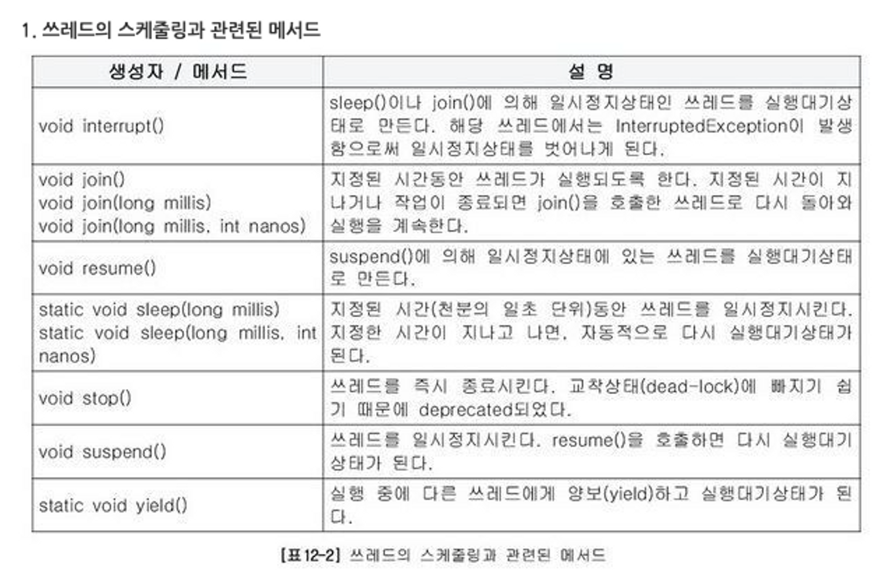
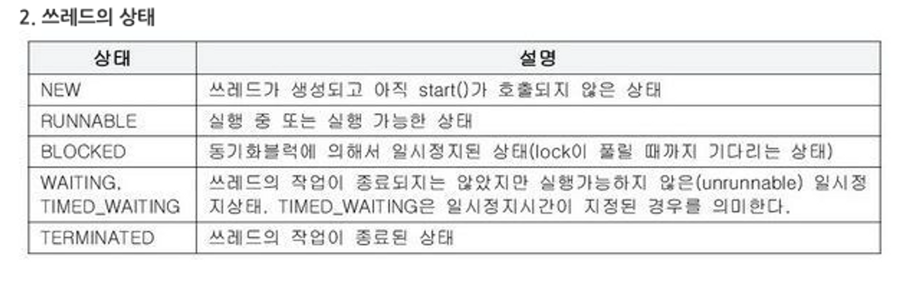
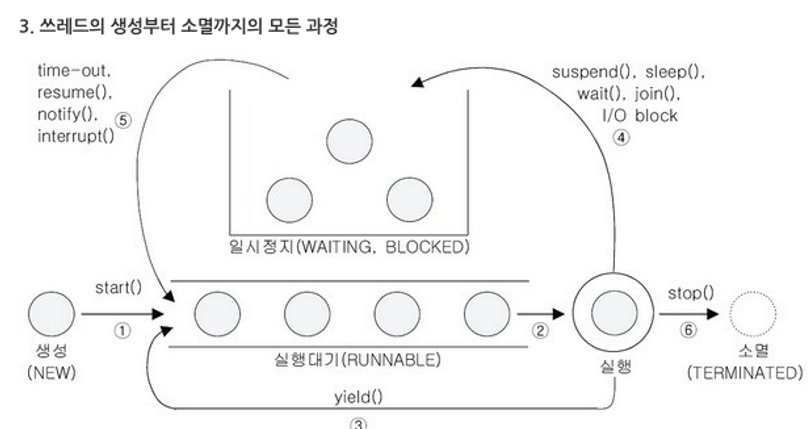

# 쓰레드

## 데몬 쓰레드

데몬 쓰레드는 다른 일반 쓰레드의 작업을 돕는 보조적인 역할을 수행하는 쓰레드이다. 일반 쓰레드가 모두 종료되면 데몬 쓰레드는 강제적으로 자동 종료되는데 그 이유는 데몬 쓰레드는 일반 쓰레드의 보조 역할을 하기 때문이다 이점을 제외하고는 데몬 쓰레드와 일반 쓰레드는 다르지 않다 데몬 쓰레드는 가비지 컬렉터, 워드프로세서의 자동저장, 화면자동갱신 등이 있다

데몬 쓰레드는 일반 쓰레드의 작성방법과 실행방법이 같으며 다만 쓰레드를 생성한 다음 실행하기 전에 setDaemon(true) 를 호출하기만 하면 된다. 그리고 데몬 쓰레드가 생성한 쓰레드는 자동적으로 데몬 쓰레드가 된다는 점도 알아두자

```java
boolean isDaemon(); //쓰레드가 데몬 쓰레드인지 확인한다 데몬 쓰레드이면 true
void setDaemon(); //쓰레드를 데몬 쓰레드로 또는 사용자 쓰레드로 변경한다 매개변수 on의 값을 true로
// 지정하면 데몬 쓰레드가 된다
```

```java
class ThreadEx10 implements Runnable {
    static boolean autoSave = false;

    public static void main(String[] args) {
        Thread t = new Thread(new ThreadEx10());
        t.setDaemon(true); //이 부분이 없으면 종료되지 않는다.
        t.start();
        for (int i = 1; i <= 10; i++) {
            try {
                Thread.sleep(1000);
            } catch (InterruptedException e) {
            }
            System.out.println(i);
            if (i == 5)
                autoSave = true;
        }
        System.out.println("프로그램을 종료합니다");
    }

    public void run() {
        while (true) {
            try {
                Thread.sleep(3 * 1000); // 3초마다
            } catch (InterruptedException e) {
            }
            //autosave의 값이 true이면 autosave ()를 호출한다.
            if (autoSave) {
                autoSave();
            }
        }
    }

    public void autoSave () {
        System.out.println("작업 파일이 자동저장되었습니다.");
    }
}
```

```
1
2
3
4
5
6
작업 파일이 자동저장되었습니다
7
8
작업 파일이 자동저장되었습니다
9
10
프로그램을 종료합니다
```

setDaemon 메서드는 반드시 start()를 호출하기 전에 실행되어야 한다. 그렇지않으면 IllegalThreadStateException 이 발생한다

프로그램을 실행하면 JVM은 가비지컬렉션, 이벤트처리, 그래픽처리와 같이 프로그램이 실행되는 데 필요한 보조작업을 수행하는 데몬 쓰레드들을 자동적으로 생성해서 실행시킨다 그리고 이들은 system쓰레드 그룹 또는 main쓰레드 그룹에 속한다

## 쓰레드의 실행제어

쓰레드 프로그래밍이 어려운 이유는 동기화와 스케줄링때문이다 우선순위를 통해 쓰레드간의 스케줄링을 하는 방법을 배우기는 햇지만, 부족하다 효율적인 멀티쓰레드 프로그램을 만들기 위해서는 보다 정교한 스케줄링을 통해 프로세스에 주어진 자원과 시간을 여러 쓰레드가 낭비없이 잘 사용하도록 프로그래밍 해야 한다

쓰레드의 스케줄링과 관련되 메서드는 다음과 같다



쓰레드의 상태이다





1. 쓰레드를 생성하고 start()를 호출하면 바로 실행되는 것이 아니라 실행대기열에 저장되어 자신의 차례가 될 때까지 기다려야 한다. 실행대기열은 큐(queue)와 같은 구조로 먼저 실행대기열에 들어온 쓰레드가 먼저 실행된다.

2. 실행대기상태에 있다가 자신의 차례가 되면 실행상태가 된다.

3. 주어진 실행시간이 다되거나 yield()를 만나면 다시 실행대기상태가 되고 다음 차례의 쓰레드가 실행상태가 된다.

4. 실행 중에 suspend(), sleep(), wait(), join(), I/O block에 의해 일시정지상태가 될 수 있다. I/O block은 입출력작업에서 발생하는 지연상태를 말한다. 사용자의 입력을 기다리는 경우를 예로 들 수 있는데, 이런 경    우 일시정지 상태에 있다가 사용자가 입력을 마치면 다시 실행대기상태가 된다.

5. 지정된 일시정지시간이 다되거나(time-out), notify(), resume(), interrupt()가 호출되면 일시정지 상태를 벗어나 다시 실행대기열에 저장되어 자신의 차례를 기다리게 된다.

6. 실행을 모두 마치거나 stop()이 호출되면 쓰레드는 소멸된다.

cf.) 1부터 6까지 번호를 붙였으나 번호의 순서대로 쓰레드가 수행되는 것은 아니다.

### sleep(long millis) - 일정시간동안 쓰레드를 멈추게 한다

```
class ThreadEx15{

	public static void main(String args[]) {

		A th1 = new A();

		B th2 = new B();

		th1.start();

		th2.start();

		try {

			th1.sleep(5000);	

  // sleep(): 작업 흐름 대기시간 설정한다. 5초동안 대기시간 갖은 후에 다음 문자의 실행흐름을 이어 나간다.

		} catch(InterruptedException e) {}

		System.out.print("<<main 종료>>");

	} // main

}

class A extends Thread {

	public void run() {

		for(int i=0; i < 300; i++) {

			System.out.print("-");

		}

		System.out.print("<<th1 종료>>");

	} // run()

}

class B extends Thread {

	public void run() {

		for(int i=0; i < 300; i++) {

			System.out.print("|");

		}

		System.out.print("<<th2 종료>>");

	} // run()

}
```

결과를 보면 쓰레드 th1의 작업이 가장 먼저 종료되었고, 그 다음이 th2, main의 순인 것을 알 수 있다.

th1과 th2에 대해 start()를 호출하자마자 th1.sleep(5000)을 호출하여 쓰레드 th1이 5초동안 작업을 멈추고 일시정지상태에 있도록 하였으니까 쓰레드 th1이 가장 늦게 종료되어야 하는데 결과에서는 제일 먼저 종료되었다. 그 이유는 sleep()이 항상 현재 실행 중인 쓰레드에 대해 작동하기 때문에 th1.sleep(5000)과 같이 호출하였어도 실제로 영향을 받는 것은 main 메서드를 실행하는 main 쓰레드이다.

그래서 sleep()은 static으로 선언되었으며 참조변수를 이용해서 호출하기 보다는 Thread.sleep(5000);과 같이 해야 한다. yield() 또한 이와 같은 이유에서 static으로 선언되어 있어서 항상 현재

실행 중인 쓰레드에 대해 동작하며 Thread.yield()와 같이 호출해야 한다.

### interrupt()와 interrupted() - 쓰레드의 작업을 취소한다

진행중인 쓰레드의 작업이 끝나기 전에 취소시켜야할 때가 있다. 예를 들어 큰 파일을 다운로드받을 때 시간이 너무 오래 걸리면 중간에 다운로드를 포기하고 취소할 수 있어야 한다. interrupt()는 쓰레드에게 작업을 멈추라고 요청한다 요청뿐 강제로 종료시키진 못한다 interrupt는 그저 쓰레드의 interrupted상태를 바꾸는 것일 뿐이다

그리고 interrupted()는 쓰레드에 대해 interrupt()가 호출되었는지 알려준다

### suspend(), resume(), stop()

suspend는 sleep처럼 쓰레드를 멈추게 한다 suspend에 의해 정지된 쓰레드는 resume을 호출해야 다시 실행대기 상태가 된다 stop은 실행되는 순간 쓰레드가 종료된다

이 메서드들은 쓰레드의 실행을 제어하는 손쉬운 방법이지만 교착상태를 일으키기 쉽게 작성되어있으므로 사용이 권장되지 않는다 그래서 이 메서드들은 모두 deprecated됬다

### yield - 다른 쓰레드에게 양보한다

yield는 쓰레드 자신에게 주어진 실행시간을 다음 차례의 쓰레드에게 양보한다

예를 들어 스케줄러에 1초의 실행시간을 할당받은 쓰레드가 0.5초의 시간동안 작업한 상태에서 yield가 호출되면 나머지 0.5초는 포기하고 다시 실행대기상태가 된다 yield와 interrupt를 적절히 사용하면 프로그램의 응답성을 높이고 보다 효율적인 실행이 가능하게 할 수 있다.

```java
class ThreadEx19 {

	public static void main(String args[]) {

		MyThreadEx19 th1 = new MyThreadEx19("*");

		MyThreadEx19 th2 = new MyThreadEx19("**");

		MyThreadEx19 th3 = new MyThreadEx19("***");

		th1.start();

		th2.start();

		th3.start();

		try {

			Thread.sleep(2000);

			th1.suspend();

			Thread.sleep(2000);

			th2.suspend();

			Thread.sleep(3000);

			th1.resume();

			Thread.sleep(3000);

			th1.stop();

			th2.stop();

			Thread.sleep(2000);

			th3.stop();

		} catch (InterruptedException e) {}

	}

}

class MyThreadEx19 implements Runnable {

	boolean suspended = false;

	boolean stopped = false;

	Thread th;

	MyThreadEx19(String name) {

		th = new Thread(this, name); // Thread(Runnable r, String name)

	}

	public void run() {

		String name = Thread.currentThread().getName();

// yield가 없다면 suspended값이 true라고 할때 쓰레드는 주어진 실행시간을 while문을 돌면서 의미없이
//낭비할 것이다 이런 상황을 바쁜 대기상태라고 한다 그러나 이 코드에서는 yield를 호출하여 남은 실행시간을
//while문에서 낭비하지않고 다른 쓰레드에 양보하게 되므로 더 효율적이다
		while(!stopped) {

			if(!suspended) {

				System.out.println(name);

				try {

					Thread.sleep(1000);

				} catch(InterruptedException e) {

					System.out.println(name + " - interrupted");

				}			

			} else {

				Thread.yield();

			}

		}

		System.out.println(name + " - stopped");

	}

	public void suspend() {

		suspended = true;

		th.interrupt();

// interrupt(): 특정 객체를 멈추고자 할때 사용, 쓰레드의 권한 중지

		System.out.println("interrupt() in suspend()");

	}

	public void resume() {

		suspended = false;

	}

	public void stop() {

		stopped = true;

		th.interrupt();

		System.out.println("interrupt() in stop()");

	}

	public void start() {

		th.start();

	}

}
```

```
*
**
***
*
**
***
*
interrupt() in suspend()
* - interrupted
***
**
**
***
** - interrupted
interrupt() in suspend()
***
***
***
*
***
*
***
*
***
*
interrupt() in stop()
interrupt() in stop()
* - interrupted
* - stopped
** - stopped
***
***
interrupt() in stop()
*** - interrupted
*** - stopped
```

- yield(): yield()를 호출해서 남은 실행시간을 while문에서 낭비하지 않고, 다른 쓰레드에게 양보하게 된다.
- interrupt(): InterruptedException을 발생시켜서 sleep(), join(), wait()에 의해 일시정지 상태인 쓰레드를 실행대기상태로 만든다. interrupt()가 호출되었을 때, sleep(), join(), wait()에 의한 일시정지상태가 아니라면 아무런 일도 일어나지 않는다. 만일 stop()이 호출되었을 때 Thread.sleep(1000)에 의해 쓰레드가 일시정지상태에 머물러 있는 상황이라면 쓰레드가 정지될 때까지 최대 약 1초의 시간지연이 생길 것이다. 그래서 잠자고 있는 쓰레드를 깨울 interrupt()가 필요하다. 같은 상황에서 interrupt()가 호출되면, Thread.sleep(1000)에서 InterruptedException이 발생하고 즉시 일시정지상태에서 벗어나 catch 블럭 내의 문장이 실행된다.

이처럼 interrupt()를 사용하면 쓰레드의 응답성을 높일 수 있다.

### join() - 다른 쓰레드의 작업을 기다린다

쓰레드 자신이 하던 작업을 잠시 멈추고 다른 쓰레드가 지정된 시간동안 작업을 수행하도록 할 때 join을 사용한다.

시간을 지정하지 않으면 해당 쓰레드가 작업을 모두 마칠 때까지 기다리게 된다 작업중에 다른 쓰레드의 작업이 먼저 수행되어야할 필요가 있을 때 join사용한다

join도 sleep처럼 interrupt에 의해 대기상태에서 벗어날 수 있으며 join이 호출되는 부분을 try catch문으로 감싸야 한다. join은 여러모로 sleep()과 유사한 점이 많은데 sleep과 다른 점은 join은 현재 쓰레드가 아닌 특정 쓰레드에 대해 동작하므로 static메서드가 아니라는 점이다

```java
class ThreadEx13 {

	static long startTime = 0;

	public static void main(String args[]) {

		A th1 = new A();

		B th2 = new B();

		th1.start();

		th2.start();

		startTime = System.currentTimeMillis();

		try {

			th1.join();	// th1의 작업이 끝날 때까지 기다린다.

			th2.join();	// th2의 작업이 끝날 때까지 기다린다.

		} catch(InterruptedException e) {}

		System.out.print("소요시간:" + (System.currentTimeMillis() - ThreadEx13.startTime));

	} // main

}

class A extends Thread {

	public void run() {

		for(int i=0; i < 300; i++) {

			System.out.print("-");

		}

	} // run()

}

class A extends Thread {

	public void run() {

		for(int i=0; i < 300; i++) {

			System.out.print("|");

		}

	} // run()

}
```

```
--------------------------------------------------------------------
----------------------|---------------------------------------------
-----------------------------------------------------------|--------
--------------------------------------------------------------------
------------------------------||||||||||||||||||||||||||||||||||||||
||||||||||||||||||||||||||||||||||||||||||||||||||||||||||||||||||||
||||||||||||||||||||||||||||||||||||||||||||||||||||||||||||||||||||
||||||||||||||||||||||||||||||||||||||||||||||||||||||||||||||||||||
||||||||||||||||||||||||||||||||||||||||||||||||||||||||소요시간:13
```

join을 사용하지 않았으면 main쓰레드는 바로 종료되었겠지만 join으로 쓰레드 th1과 th2가 작업을 마칠 떄 까지 main쓰레드가 기다리도록 했다. 그래서 main쓰레드가 두 쓰레드의 작업에 소요된 시간을 출력할 수 있다

## 쓰레드의 동기화

싱글쓰레드 프로세스의 경우 프로세스 내에 단 하나의 쓰레드만 작업하기 때문에 프로세스의 자원을 가지고 작업하는 데 별문제가 없지만, 멀티쓰레드 프로세스의 경우 여러 쓰레드가 같은 프로세스 내의 자원을 공유해서 작업을 하기 때문에 서로의 작업에 영향을 주게 된다. 만일 쓰레드A가 작업하던 도중에 다른 쓰레드B에게 제어권이 넘어갔을 때, 쓰레드A가 작업하던 공유 데이터를 쓰레드B가 임의로 변경하였다면, 다시 쓰레드A가 제어권을 받아서 나머지 작업을 마쳤을 때 원래 의도했던 것과는 다른 결과를 얻을 수 있다.

이러한 일이 발생하는 것을 방지하기 위해서 한쓰레드가 특정 작업을 끝마치기 전까지 다른 쓰레드에 의해 방해받지 않도록 하는 것이 필요하다 그래서 도입된 개념이 바로 임계 영역과 잠금(락) 이다

공유 데이터를 사용하는 코드 영역을 임계영역으로 지정해놓고 공유 데이터가 가지고 있는 lock을 획득한 단 하나의 쓰레드만 이 영역 내의 코드를 수행할 수 있게 한다. 그리고 해당 쓰레드가 임계영역 내의 모든 코드를 수행하고 벗어나서 lock을 반납해야만 다른 쓰레드가 반납된 lock을 획득하여 임계영역의 코드를 수행할 수 있게 된다 이처럼 한 쓰레드가 진행 중인 작업을 다른 쓰레드가 간섭하지 못하도록 막는 것을 쓰레드의 동기화 라고 한다

이처럼 멀티쓰레드 프로그래밍에서 동기화는 중요한 요소이다. 얼마만큼 동기화를 잘 처리하는가에 따라서 프로그램의 성능에 많은 영향을 미치게 된다.

### synchronized를 이용한 동기화

```java
//메서드 전체를 임계 영역으로 지정
public synchronized void calcSum() {
}
//특정한 영역을 임계 영역으로 지정
public synchronized(객체의 참조변수) {
}
```

첫번째 방법은 메서드 앞에 synchronized를 붙이는 것인데 synchronized를 붙이면 메서드 전체가 임계 영역으로 설정된다. 쓰레드는 synchronized메서드가 호출된 시점부터 해당 메서드가 포함된 객체의 lock을 얻어 작업을 수행하다가 메서드가 종료되면 lock을 반환한다

두번째 방법은 메서드 내의 코드 일부를 {} 이걸로 감싸고 앞에 synchronized(참조변수) 를 붙히는 건데 이때 참조변수는 락을 걸고자 하는 객체를 참조하는 것이어야 한다 이 블럭은 synchronized 블럭이라고 하며 이 블럭의 영역 안으로 들어가면서부터 쓰레드는 지정된 객체의 lock을 얻게 되고 이 블럭을 벗어나면 lock을 반납한다

두 방법 모두 lock의 획득과 반납이 모두 자동적으로 이루어지므로 우리가 해야 할 일은 그저 임계영역만 설정해주는 것뿐이다

임계영역은 멀티쓰레드 프로그램의 성능을 좌우하기 때문에 가능하면 메서드 전체에 락을 거는 것보다 synchronized블럭으로 임계 영역을 최소화 해서 보다 효율적인 프로그램이 되도록 노력해야 한다

```java
class ThreadEx24 {

	public static void main(String args[]) {

		Runnable r = new A();

		Thread t1 = new Thread(r);

		Thread t2 = new Thread(r);

		t1.start();

		t2.start();

	}

}

class Account {

	int balance = 1000;

	public void withdraw(int money){

		if(balance >= money) {

			try { Thread.sleep(1000);} catch(Exception e) {}

			balance -= money;

		}

	} // withdraw

}

class A implements Runnable {

	Account acc = new Account();

	public void run() {

		while(acc.balance > 0) {

			// 100, 200, 300중의 한 값을 임으로 선택해서 출금(withdraw)

			int money = (int)(Math.random() * 3 + 1) * 100;

			acc.withdraw(money);

			System.out.println("balance:"+acc.balance);

		}

	} // run()

}
```

```java

balance:700

balance:500

balance:200

balance:200

balance:0

balance:-100
```

실행결과를 보면 잔고(balance)가 음수인 것을 알 수 있다. 그 이유는 한 쓰레드가 if문의 조건식을 통과하고 출금하기 바로 직전에 다른 쓰레드가 끼어들어서 출금을 먼저 했기 때문이다.

에를 들어 한 쓰레드가 id문의 조건식을 통과하고 출금하기 바로 직전에 다른 쓰레드가 끼어들어서 출금을 먼저 했기 때문이다. 예를 들어 한 쓰레드가 if문의 조건식을 계산했을 때는 잔고(balane)가 200이고 출금하려는

금액(money)이 100이라서 조건식(balance >= money)이 true가 되어 출금(balance -= money)을 수행하려는 순간 다른 쓰레드에게 제어권이 넘어가서 다른 쓰레드가 200을 출금하여 잔고가 0이 되었다.

다시 이전의 쓰레드로 제어권이 넘어오면 if문 다음부터 수행하게 되므로 확인하는 if문과 출금하는 문장은 하나로 동기화블록으로 묶어져야 한다.

예제에서는 상황을 보여주기 위해 일부러 Thread.sleep(1000)을 사용해서 if문을 통과하자마자 다른 쓰레드에게 제어권이 넘기도록 하였지만, 굳이 이렇게 하지 않더라도 쓰레드의 작업이 다른 쓰레드에 의해서 영향을 받는 일이 발생할 수 있기 때문에 동기화가 반드시 필요하다.

```java
class ThreadEx24 {

	public static void main(String args[]) {

		Runnable r = new A();

		Thread t1 = new Thread(r);

		Thread t2 = new Thread(r);

		t1.start();

		t2.start();

	}

}

class Account {

	int balance = 1000;

	public synchronized void withdraw(int money){ //synchronized 키워드를 붙이기만 하면 간단히 동기화가 된다.

		if(balance >= money) {

			try { Thread.sleep(1000);} catch(Exception e) {}

			balance -= money;

		}

	} // withdraw

}

class A implements Runnable {

	Account acc = new Account();

	public void run() {

		while(acc.balance > 0) {

			// 100, 200, 300중의 한 값을 임으로 선택해서 출금(withdraw)

			int money = (int)(Math.random() * 3 + 1) * 100;

			acc.withdraw(money);

			System.out.println("balance:"+acc.balance);

		}

	} // run()

}
```

```java
balance:800

balance:700

balance:500

balance:300

balance:100

balance:100

balance:0

balance:0
```

한 쓰레드에 의해서 먼저 withdraw()가 호출되면, 종료될 때까지 다른 쓰레드가 withdraw()를 호출하더라도 대기상태에 머물게 된다. 즉, withdraw()는 한 순간에 단 하나의 쓰레드만 사용할 수 있다는 것이다.