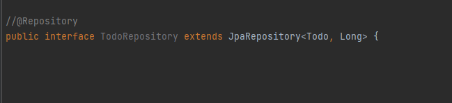

# Repository Layer 구현

# Repository Layer란?

- 데이터 액세스 로직을 담당하는 계층
- 인터페이스를 사용해서 데이터 액세스를 추상화 한다.
- ORM 기술을 사용해서 데이터베이스와 상호작용한다.

## DAO

직접 sql 쿼리 작성 → 데이터베이스와 직접적으로 상호작용

```java
public interface UserDao {
    public void addUser(User user);
    public User getUserById(int id);
    public List<User> getAllUsers();
    public void updateUser(User user);
    public void deleteUser(int id);
}

public class UserDaoImpl implements UserDao {

    private JdbcTemplate jdbcTemplate;

    public void setDataSource(DataSource dataSource) {
        this.jdbcTemplate = new JdbcTemplate(dataSource);
    }

    public void addUser(User user) {
        String sql = "INSERT INTO users (id, name, email) VALUES (?, ?, ?)";
        jdbcTemplate.update(sql, user.getId(), user.getName(), user.getEmail());
    }

    public User getUserById(int id) {
        String sql = "SELECT * FROM users WHERE id = ?";
        return jdbcTemplate.queryForObject(sql, new Object[] { id }, new UserRowMapper());
    }

    public List<User> getAllUsers() {
        String sql = "SELECT * FROM users";
        return jdbcTemplate.query(sql, new UserRowMapper());
    }

    public void updateUser(User user) {
        String sql = "UPDATE users SET name = ?, email = ? WHERE id = ?";
        jdbcTemplate.update(sql, user.getName(), user.getEmail(), user.getId());
    }

    public void deleteUser(int id) {
        String sql = "DELETE FROM users WHERE id = ?";
        jdbcTemplate.update(sql, id);
    }
}
```

## Repository

orm 기술사용 → 데이터베이스와의 상호작용의 추상화
**ORM**(객체 관계 매핑) : 객체는 객체답게, RDB는 RDB답게 설계해. 그러면 ORM 프레임워크가 중간에서 매핑해준다.

```java
public interface UserRepository extends JpaRepository<User, Long> {
}
```

<aside>
💡 김영한님 답변
	
**DAO** : 데이터에 접근하도록 DB접근 관련 로직을 모아둔 객체  
**Repository** : 엔티티 객체를 보관하고 관리하는 저장소

</aside>

# JPA repository 구현 설명

## 순수 JPA 기반 리포지토리

JPA - Java Persistence(영구적인) Api : 자바 진영의 ORM 기술 표준

```java
@Repository
public class TaskJpaRepository {

	@PersistenceContext
	private EntityManager em;

	public Tasksave(Task task) {
			em.persist(task);
			return task;
	}
	public void delete(Task task) {
			em.remove(task);
	}
	public List<Todo> findAll() {
			return em.createQuery("select t from Task t", Task.class)
								.getResultList();
	}
	public Optional<Task> findById(Long id) {
			Task task= em.find(Task.class, id);
			return Optional.ofNullable(task);
	}

	public long count() {
			return em.createQuery("select count(t) from Taskt", Long.class)
						.getSingleResult();
	}

	public Task find(Long id) {
			return em.find(Task.class, id);
	}
}

```

### **JPQL(Java Persistence Query Language)**

JPQL은 엔티티 객체를 조회하는 객체지향 쿼리다.

**테이블을 대상으로 쿼리하는 것이 아니라 엔티티 객체를 대상으로 쿼리한다.**

SQL과 비슷한 문법을 가지며, JPQL은 결국 SQL로 변환된다.

## Spring data jpa 기반 Repository

Spring data jpa : jpa를 쓰기 쉽게 추상화 시킨 모듈




 실제 클래스가 아닌 프록시 객체 ⇒ spring data jpa가 인터페이스를 보고 구현클래스를 꽂아버렸다는 뜻

- Entity 클래스 생성


- Repository 인터페이스 생성


타입에 맞춰 작성한다. <엔티티클래스, 매핑된 pk>

- 메소드 작성


[https://docs.spring.io/spring-data/jpa/docs/current/reference/html/#jpa.query-methods](https://docs.spring.io/spring-data/jpa/docs/current/reference/html/#jpa.query-methods)

- 의존성 주입

# JPA repository 추가하는 방법

- 사용자 정의 인터페이스 정의

```java
public interface MemberRepositoryCustom {

    List<MemberTeamDto> search(MemberSearchCondition condition);

}
```

- 사용자 정의 인터페이스 구현

```java
public class MemberRepositoryImpl implements MemberRepositoryCustom{

    private final JPAQueryFactory queryFactory;

    public MemberRepositoryImpl(EntityManager em) {
        this.queryFactory = new JPAQueryFactory(em);
    }

    @Override
    public List<MemberTeamDto> search(MemberSearchCondition condition) {
        return queryFactory
                .select(new QMemberTeamDto(
									member.id.as("memberId"),
									member.username,
									member.age,
									team.id.as("teamId"),
									team.name.as("teamName")
                ))
                .from(member)
                .leftJoin(member.team,team)
                .where(
                        usernameEq(condition.getUsername()),
                        teamNameEq(condition.getTeamName()),
                        ageGoe(condition.getAgeGoe()),
                        ageLoe(condition.getAgeLoe())
                )
                .fetch();
    }

}
```

- Spring Data JPA Repository에 사용자 정의 인터페이스 상속

```java
public interface MemberRepository extends JpaRepository<Member, Long>, 
MemberRepositoryCustom {
    
}
```
