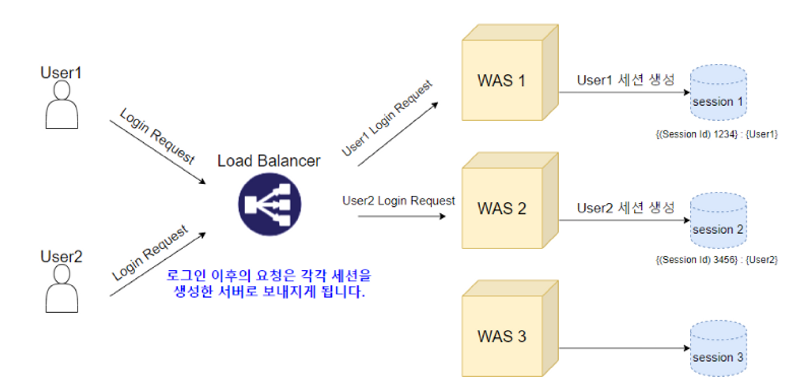
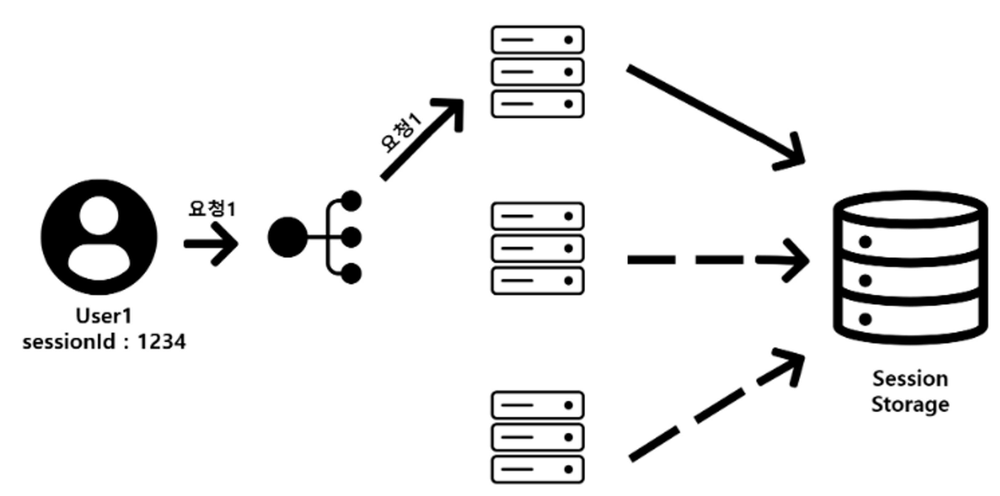
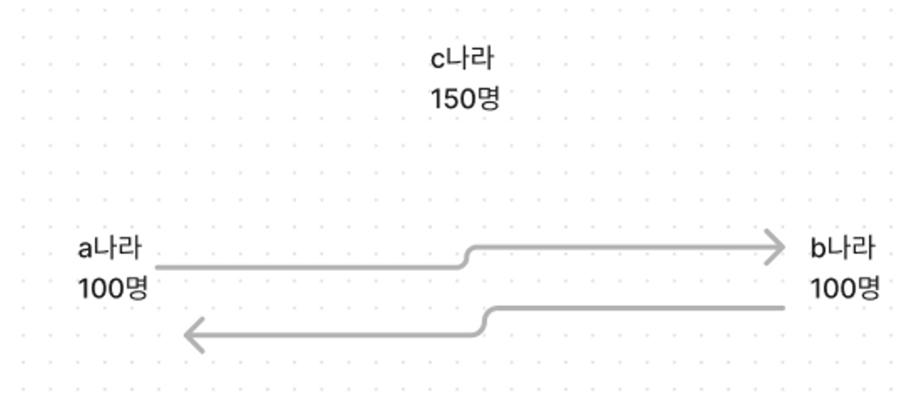
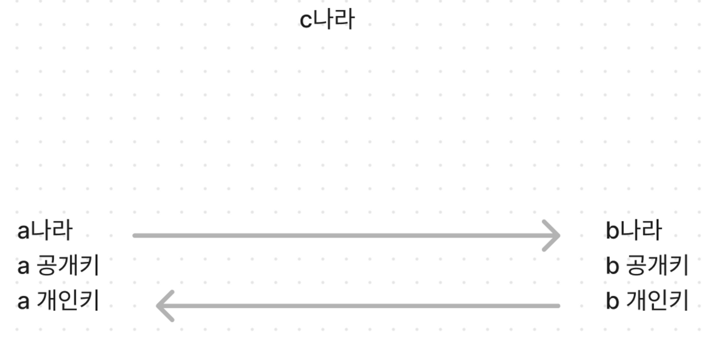
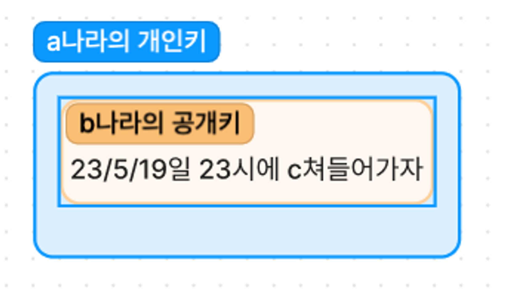
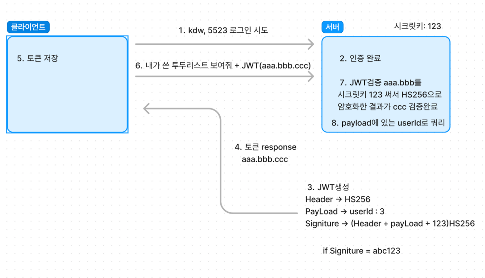

# JWT

## 인증(****Authentication****)

유저가 누구인지 확인하는 절차, 회원가입하고 로그인 하는 것

## 인가란(****Authorization****)

유저에 대한 권한을 허락하는 것


## 세션의 단점

유저가 많아서 동접자 수가 평균적으로 900명씩 된다 근데 우리 서버는 동접자를 300명으로 한 서버다 그럼 나머지 600명이 기다려야된다 그럼 그런 사이트들은 서버를 3개를 만들어야 된다 이상태에서 요청을 할 때 LoadBalancing 으로 부하분산을 시켜서 3개의 서버를(1, 2, 3) 골고루 사용한다 하자 유저 A가 2번째 서버에 로그인 요청을 하고 세션영역에 세션을 만들어서 세션 아이디를 응답을 해줬다, 유저 A가 2번째 서버에 또 요청을 하면 아무런 문제가 없다 근데 만약에 2번째 서버가 너무 바빠서 1, 3 번에 요청을 한다 하면 어떻게 될까 1, 3번의 세션 영역엔 이 유저A의 세션값이 없다 → 이 유저가 누군지도 모른다 → 정합성 이슈

## 해결방안

### 1. **Sticky Session이란?**

세션을 사용하여 트래픽을 분산하는 것이다.

1번 서버에 로그인한 유저는 이후의 요청을 무조건 1번 서버에 하는 방식 → 정합성 이슈를 해결할 수 있지만 스케일 아웃의 장점인 가용성과 트래픽 분산을 완벽히 사용할 수는 없어 보입니다.

### 2. Session Clustering

session2 에 유저A 의 세션 아이디가 있으면 세션 1, 3에 복제를 시켜준다 → 모든 서버가 동일한 세션 객체를 가져야 하기 때문에 많은 메모리가 필요합니다. 또한 세션 저장소에 데이터가 저장될 때마다 모든 서버에 값을 입력해야 하므로 서버 수에 비례하여 네트워크 트래픽이 증가하는 등 성능 저하가 발생하게 됩니다.

### 3. Session Server 분리


세션 서버를 따로 분리해서 만들어준다

대신 세션 서버의 중요성이 올라가고, 해당 세션 서버가 죽는 순간 모든 세션이 사라지기 때문에 이 Redis 서버의 다중화도 고려해보아야 할 점이다.

**결론 → 귀찮다**

## JWT의 원리

### 1. CIA



a나라 100명, b나라 100명, c나라 150 명 a 나라가 b 나라한테 23/5/19일 23시에 c쳐들어가자고 기밀문서를 보내야됨 b나라한테 쳐들어가자 했는데 a는 b나라가 문서를 잘 봤는지 ACK(응답) 을 받아야됨 아니면 자기 혼자 100명끌고 쳐들어가서 150명한테 죽음

1. C: 기밀성 → a나라에서 b나라에게 기밀 문서를 보내야되는데 중간에 c나라가 가로채서 내용 확인 → 기밀성이 꺠짐
2. I: 무결성 → a나라에서 b나라에게 기밀 문서를 보내는 중간에 c나라가 문서를 바꿔서 b나라에 보낸다 → 무결성이 깨짐
3. A: 가용성 → 기밀성과 무결성이 꺠지면 b나라는 문서를 가용할 수 없다 → 가용성이 깨짐

이 전부를 지켜야 한다

문서를 a라는 열쇠로 암호화해서 보내면 괜찮지 않을까?

문제1: 근데 만약에 여기서 b나라에서 a열쇠가 없어, 그럼 열어볼 수 없으니 가용성이 깨진다 결국 a 나라에서 a열쇠를 b나라에 전달 해야 한다 그 열쇠 c한테 털리면 어쩔건데

문제2: b나라가 문서를 받았는데 b입장에서는 이게 c가 보낸건지 a가 보낸건지 알수 없음 c가 보낸거라면 낙동강 오리알

결론 → 이 문서가 누구로부터 왔는지 알아야 한다 + 열쇠 전달 문제를 해결하면 된다


### 2. RSA

a나라와 b나라는 public 키(공개키)와 private 키(개인키) 두개를 갖는다

공개키는 블로그에 있다, 각 나라의 공개키는 해당 나라의 개인키로만 열 수 있고 각 나라의 개인키는 각나라의 공개키로만 열 수 있다

1. 탈취되도 된다고 가정했을때 a나라가 쳐들어가자는 메시지에 b의 공개키로 암호화를 한다 → b공개키는 b개인키로만 열 수 있기 때문에 c가 중간에 가로채도 열어볼 수 없다 이러면 열쇠 전달의 문제를 해결할 수 있다 (암호화로 사용)
2. 내용이 노출되도 된다고 가정했을때 a 나라가 메시지(a:b 23/5/19일 23시에 가자)를 a나라의 개인키로 b에게 보낸다 그럼 c는 블로그에서 a의 공개키를 사용해서 a의 개인키를 열어본다 내용이 a:b 가 있다 그럼 b나라 입장에선 이건 확실하게 a나라가 적은글이 확실하다 왜? a나라의 공개키로 열었으니까 a나라의 비밀키로 잠근거다 a나라의 비밀키를 갖고 있는 건 무조건 a나라다 (서명(인증)으로 사용)

> 공개키 → 개인키 (암호화) 아 확실하게 암호화된 문서구나(암호)
>

> 개인키 → 공개키 (인증) 아 확실하게 a가 보낸 문서구나(서명)
>


이러면 모든게 해결이된다 b나라 입장에서 보자

1. 문서 받으면
2. a나라의 공개키로 열어본다
    1. 안열리면? 이거 a나라가 보낸건지 c나라가 보낸건지 모름 → 폐기
    2. 열리면? 인증 ok 3번으로
3. b의 개인키로 열어본다
    1. 안열리면? 이거 c가 중간에 탈취해서 알고 있을 수도있음 → 폐기
    2. 열리면? 끝


## JWT란?

[JWT.IO - JSON Web Tokens Introduction](https://jwt.io/introduction/)

JWT(JSON Web Token)는 당사자 간에 정보를 JSON 개체로 안전하게 전송하기 위한 간결하고 독립적인 방법을 정의하는 개방형 표준( [RFC 7519 )입니다.](https://tools.ietf.org/html/rfc7519) 이 정보는 디지털 서명되어 있으므로 확인하고 신뢰할 수 있습니다. JWT는 비밀( **HMAC 알고리즘 포함) 또는 RSA** 또는 **ECDSA를** 사용하는 공개/개인 키 쌍을 사용하여 서명할 수 있습니다 .

JWT를 암호화하여 당사자 간에 비밀성을 제공할 수도 있지만 여기서는 *서명된* 토큰에 중점을 둘 것입니다. 서명된 토큰은 그 안에 포함된 클레임의 *무결성을* 확인할 수 있는 반면 암호화된 토큰은 다른 당사자로부터 해당 클레임을 *숨깁니다 .* 공개/개인 키 쌍을 사용하여 토큰에 서명할 때 서명은 개인 키를 보유한 당사자만이 서명한 당사자임을 인증합니다.

내가 만든 token이 내가 발급한거 맞아! → 서명

너랑 나 이외에 아무도 몰라 → 암호화

3가지로 구성되어 있다 Header Payload Signature xxxxx.yyyyy.zzzzz

### Header

```json
{
  "alg": "HS256",
  "typ": "JWT"
}
```

알고리즘은 HS256 사용했고 타입은 JWT다

그런 다음 JSONdms Base64Url로 인코딩 되어 JWT의 첫 번째 부분을 형성합니다. (Base64는 디코딩이 가능하다)

HS256란?

- 풀네임은 HMACSHA256
- HMAC이라는 방식으로 SHA256 으로 암호화 한다는뜻
- HMAC은 secret key(비밀키)를 포함한 암호화 방식 그럼 비밀키는 어딨냐 Signature에 있다
- SHA256 복호화가 불가한 암호화

### Payload

```json
{
  "sub": "1234567890",
  "name": "John Doe",
  "admin": true
}
```

그런 다음 JSONdms Base64Url로 인코딩 되어 JWT의 첫 번째 부분을 형성합니다. (Base64는 디코딩이 가능하다)
토큰의 두 번째 부분은 클레임을 포함하는 페이로드입니다. 클레임은 엔터티(일반적으로 사용자) 및 추가 데이터에 대한 설명입니다. *클레임에는 등록된 클레임* , *공개 클레임* 및 *비공개* 클레임 의 세 가지 유형이 있습니다 .

결국 정보를 넣는다는 뜻이고 우리는 보통 user 관련 정보를 넣는다

### Signature

```json
HMACSHA256(
  base64UrlEncode(header) + "." +
  base64UrlEncode(payload),
  secret)
```

서명 부분은 header와 payload를 넣고 나만 알고있는 개인키를 HS256으로 암호화를 한다


1. 클라이언트가 서버에 아이디 kdw 비밀번호 5523 를 서버에 전송
2. 서버 인증 완료
3. header payload signiture를 만든다 signature는 header + payload를 서버에 있는123이라는 시크릿키로 HS256으로 암호화 하고 각각을 Base64 로 인코딩을 해서 JWT를 만든다 ex)aaa.bbb.ccc
4. 클라이언트에 JWT 응답해준다
5.  그럼 클라이언트는 JWT를 저장한다
6.  다음에 인가가 필요할때 JWT를 같이 서버에 보내준다
7.  그럼 서버는 이 토큰을 검증한다 서버는 header, payload (aaa.bbb) 를 내가 알고있는 시크릿키 123으로 똑같이 HS256으로 암호화 해본다 그랬더니 그 값이 ccc가 나온다 검증 완료 → 얘 로그인한 애 맞아 인가 처리
8. payload에 있는 userId로 쿼리날리기 어떻게? payload는 base64로 인코딩 되있고 디코딩이 가능하다

서버는 시크릿키만 알고있으면 JWT를 따로 저장하지 않아도 인가가 가능하다

만약에 RSA를 사용한다? 그럼 secret키가 필요 없어진다

- signiture만들때 header + payload를 개인키로 잠그고 signiture를 만들어서 토큰을 만들어주면 된다 검증시엔 공개키로 signiture 열어보기만 하면 된다(서명)

## 결론 → 세션 필요없다 각 서버는 시크릿키 123 만 알고있으면 된다

## 그럼 JWT는 단점이 없을까?

- 하나의 기기에만 로그인 할 수 있는 서비스라면(인프런, 이러닝) pc에서 로그인하면 폰으로 로그인했을 때 pc가 강제 로그아웃 되도록 기존 세션을 종료해야 한다 (토큰은 이미 준 토큰을 뺏을 수 없는 노릇)
- 토큰을 누구한테 탈취당했을 때, 토큰을 무효화 할 방법이 없다
- 실 서비스에서 JWT만 사용해서 인가를 구현한곳은 거의 없다

## JWT단점의 해결방안

1. 토큰의 만료시간을 아주 짧게 잡아서 토큰의 수명을 짧게 준다 → 그럼 몇분마다 계속 로그인 해야돼?
2. 로그인할때, 토큰을 두개 주면 된다 수명이 몇분의 짧은 access토큰이랑 수명이 몇주~한달 정도 되는 refresh토큰을 준다
3. refresh토큰은 데이터베이스에 저장하거나 redis cache 서버에 저장한다
4. 클라이언트는 access토큰의 수명이 다하면 refresh토큰을 보낸다
5. 서버는 DB나 cache에서 refresh 토큰을 대조해보고 맞다면 새로운 access토큰을 보내주면 된다
- 이렇게하면 refresh 토큰만 관리하면 이게 유효할 동안 새로 로그인할 필요 없이 access토큰을 재발급 받으면 된다 access토큰이 탈취당해도 오래쓰지 못한다
- 강제 로그아웃이 되게 하려면 DB에서 refresh토큰을 지워버리면 된다

## JWT의 한계

토큰 하나쓰는것보단 낫지만 그래도 짧게나마 access토큰이 살아있는 동안 바로 차단할 방법은 없다

하지만 이런 문제가 큰 이슈가 안되는 프로젝트 수준에선 아주 좋은 방식이다