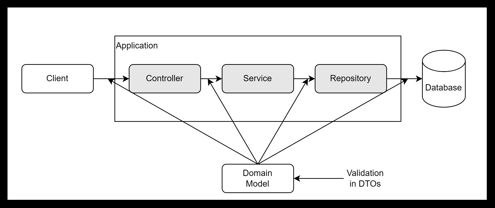

# About Validation

## Validation?

애플리케이션의 비즈니스 로직이 올바르게 동작하기 위해 데이터를 사전에 검증하는 작업

## Validation in Spring boot

이전에는 Spring boot의 의존성 중 spring-boot-starter-web에 포함  
Spring boot 2.3 이후 별도의 라이브러리 (spring-boot-starter-validation) 제공

Spring boot에서의 유효성 검사는 각 계층으로 데이터가 넘어오는 시점에 실시  
계층 간 데이터 전송을 하는 객체 = DTO(Data Transfer Object) 객체이므로, DTO 객체에서 수행하는 것이 일반적

### Validation Annotations

- 문자열 검증  
@Null : null 값만 허용  
@NotNull : null을 허용하지 않음 ("", " "는 허용)  
@NotEmpty : null, ""를 허용하지 않음 (" "는 허용)  
@NotBlank : null, "", " " 모두 허용하지 않음  

- 최댓값/최솟값 검증 (BigDecimal, BigInteger, int, long)  
@DemicalMin(value = "$numberString") : numberString보다 큰 값 허용  
@DemicalMax(value = "$numberString") : numberString보다 작은 값 허용  
@Min(value = "$number") : $number 이상의 값 허용  
@Max(value = "$number") : $number 이하 값 허용  

- 값의 범위 검증 (BigDecimal, BigInteger, int, long)  
@Positive : 양수 허용  
@Negative : 음수 허용  
@PositiveOrZero : 0을 포함한 양수 허용  
@NegativeOrZero : 0을 포함한 음수 허용  

- 시간에 대한 검증 (Date, LocalDate, LocalDateTime)  
@Future : 현재보다 미래의 날짜 허용  
@Past : 현재보다 과거의 날짜 허용  
@FutureOrPresent : 현재를 포함한 미래의 날짜 허용  
@PastOrPresent : 현재를 포함한 과거의 날짜 허용  

- 이메일 검증  
@Email : 이메일 형식을 검사, ""는 허용 

- 자릿수 범위 검증 (BigDecimal, BigInteger, int, long)  
@Digits(integer = $number1, fraction = $number2) : $number1의 정수 자릿수와 $number2의 소수 자릿수 허용  

- Boolean 검증  
@AssertTrue : true인지 체크, null은 체크하지 않음  
@AssertFalse : false인지 체크, null은 체크하지 않음  

- 문자열 길이 검증  
@Size(min = $number1, max = $number2) : $number1 이상 $number2 이하의 범위 허용  

- 정규식 검증  
@Pattern(regexp = "$expr") : 정규식을 검사 (정규식은 java.util.regex.Pattern 패키지의 컨벤션)  

---

### Valid vs Validated

유효성 검사를 시행할 때, @Valid와 @Validated 어노테이션이 존재합니다.  
과연 이 두가지 어노테이션의 차이가 무엇일까요?

> Valid : 자바 진영 / Validated : Spring에서만 사용 가능

주로, Controller에서 유효성 검사를 진행할 때는 원하는 것을 사용하는 편이고,  
Service 등 불가피하게 유효성 검사를 다른 곳에서 진행하거나 그룹화하여 검증하는 경우 @Validated를 사용한다고 합니다.

#### @Valid의 동작 원리

- HandlerMethodArgumentResolver Interface의 구현체인 RequestResponseBodyMethodProcessor Class에서 요청 처리
- resolveArgument() 메서드 내부에서 유효성 검증이 진행되며, 문제 발생 시 MethodArgumentNotValidException 발생

#### @Validated의 동작 원리

AOP를 기반으로 동작  
- ValidationAutoConfiguration class의 methodValidationPostProcessor() 메소드에서 FilteredMethodValidationPostProcessor이 빈으로 등록
- 해당 클래스의 메소드 중 createMethodValidationAdvice() 메소드를 통해 AOP Advice인 MethodValidationInterceptor를 등록
- MethodValidationInterceptor class invoke() 메소드에서 유효성 검증 진행 - ConstraintViolationException 발생