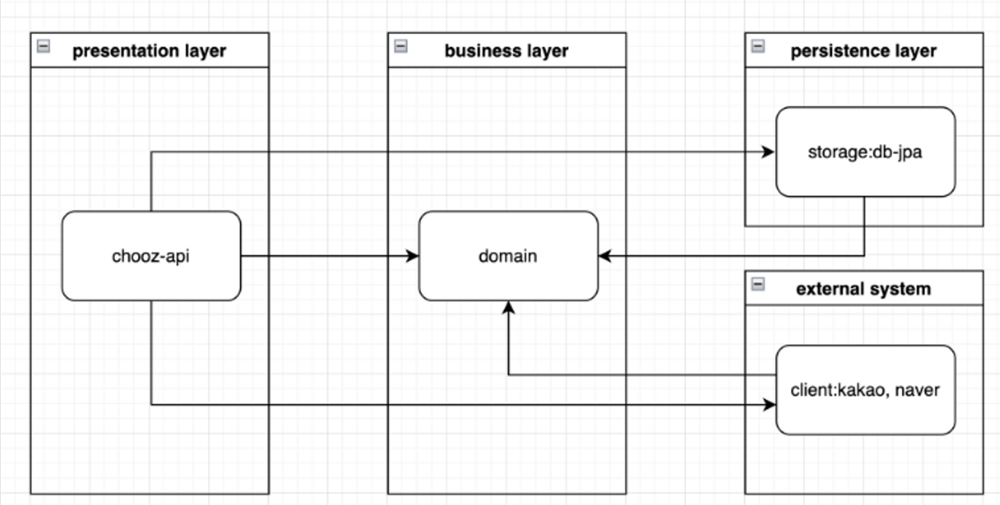
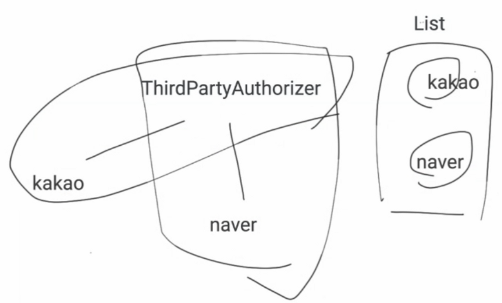

# 오버라이딩

오버라이딩은 메서드의 내용만을 새로 작성하는 것이므로 메서드의 선언부는 조상의 것과 완전히 일치해야 한다. 그래서 오버라이딩이 성립되기 위해서는

```java
자손 클래스에서 오버라이딩하는 메서드는 조상 클래스의 메서드와
- 이름이 같아야 한다
- 매개변수가 같아야 한다
- 반환 타입이 같아야 한다
```

다만 접근 제어자, 예외는 제한된 조건 하에서만 다르게 변경할 수 있다

1. 접근 제어자는 조상 클래스의 메서드보다 좁은 범위로 변경할 수 없다
    1. 만일 조상 클래스에 정의된 메서드의 접근 제어자가 protected라면 이를 오버라이딩하는 자손 클래스의 메서드는 protected나 public 이여햐 한다 보통 같은 범위의 접근 제어자를 사용하긴 한다
2. 조상 클래스의 메서드보다 많은 수의 예외를 선언할 수 없다

    ```java
    class Parent{
    	void parentMethod() throws IOException, SQLException{
    		...
    	}
    }
    
    class Child extends Parent{
    	void parentMethod() throws IOException{
    		...
    	}
    }
    
    ```

   이 코드는 Child 클래스의 parentMethod()에 선언된 예외의 개수가 조상인 Parent클래스의 parentMethod() 에 선언된 예외의 개수보다 적으므로 바르게 오버라이딩 되었다

    ```java
    class Parent{
    	void parentMethod() throws IOException, SQLException{
    		...
    	}
    }
    
    class Child extends Parent{
    	void parentMethod() throws Ecxception{
    		...
    	}
    }
    ```

   이거는?

   Exception은 모든 예외의 조상이므로 가장 많은 예외의 개수를 던질 수 있도록 선언한 것이다

   그래서 잘못된 오버라이딩인 것이다


## 예시

```java
public class OverridingTest {

	public static void main(String[] args) {
		Person person = new child();
		Child child = new Child();
		Senior senior = new Senior();
		
		person.cry();
		child.cry();
		senior.cry();
	}
}

class Person {
	void cry() {
		System.out.println("흑흑");
	}
}

class Child extends Person {
	@Override
	protected void cry() {
		System.out.println("응애");
	}
}

class Senior extends Person {
	@Override
	public void cry() {
		System.out.println("훌쩍");
	}
}
```

```java
흑흑
응애
훌쩍
```

## super, this

```java
class Parent {
    int x;
}

class Child extends Parent {
    int x = 20;
    
    void method() {
        System.out.println("x = " + x);
        System.out.println("this.x = " + this.x);
        System.out.println("super.x = " + super.x);
    }
}
```

이거 어떻게 될까요

```java
class Parent {
    public Parent(int x) {
        this.x = x;
    }

    int x;
}

class Child extends Parent {

    public Child(int x, int x1) {
				super(x)
        this.x = x1;
    }

    int x = 20;

    void method() {
        System.out.println("x = " + x);
        System.out.println("this.x = " + this.x);
        System.out.println("super.x = " + super.x);
    }
}
```

이건 어떻게 될까요

자식생성자에서 부모 생성자를 안만들어줘서 오류가 난다

```java
class Parent {
    public Parent(int x) {
        this.x = x;
    }

    int x;
}

class Child extends Parent {

    public Child(int x, int x1) {
        super(x);
        this.x = x1;
    }

    int x = 20;

    void method() {
        System.out.println("x = " + x);
        System.out.println("this.x = " + this.x);
        System.out.println("super.x = " + super.x);
    }
}
```

super(x) 는 Parent(x)를 호출한다

```java
class Parent {
    public Parent(int x) {
        this.x = x;
    }

    int x;
}

class Child extends Parent {

    public Child(int x, int x1) {
        super(x);
        this.x = x1;
    }

    int x = 20;

    void method() {
				this(1, 2)
    }
}
```

method() → Child(int x, int x1) → Parent(int x) → Object()

## 스프링에선 어떻게 사용할 수 있을까?


```java
@Service
@RequiredArgsConstructor
public class RegisterService {
    private final UserRegister userRegister;
    private final ThirdPartyAuthorizerProvider thirdPartyAuthorizerProvider;
    private final TokenGenerator tokenGenerator;

    public void signup(SocialLoginInfo socialLoginInfo) {
        userRegister.register(socialLoginInfo.getProviderId(), socialLoginInfo.getProviderType());
    }

    public LoginToken signupByThirdParty(ThirdPartySignupInfo signupInfo) {
        ThirdPartyAuthorizer authorizer = thirdPartyAuthorizerProvider.get(signupInfo.getProviderType());
        String accessToken = authorizer.getAccessToken(signupInfo);
        Map<String, String> userInfo = authorizer.getUserInfo(accessToken);
        String providerId = userInfo.get("id");

        boolean isNewUser = userRegister.registerIfNeed(providerId, signupInfo.getProviderType());

        return tokenGenerator.generate(providerId, isNewUser);
    }
}
```

```java
@Component
@AllArgsConstructor
public class ThirdPartyAuthorizerProvider {
    private final List<ThirdPartyAuthorizer> thirdPartyAuthorizers;

    public ThirdPartyAuthorizer get(ProviderType providerType) {
        return thirdPartyAuthorizers.stream()
                .filter(authorizer -> authorizer.getProviderType() == providerType)
                .findFirst()
                .orElseThrow(() -> new RuntimeException("해당하는 제공자가 없습니다."));
    }
}
```

```java
public interface ThirdPartyAuthorizer {
    String getAccessToken(ThirdPartySignupInfo signupInfo);

    Map<String, String> getUserInfo(String accessToken);

    ProviderType getProviderType();

}
```

```java
@Component
@RequiredArgsConstructor
public class KakaoAuthorizer implements ThirdPartyAuthorizer {

    @Value("${spring.oauth2.client.registration.kakao.client-id}")
    private String clientId;

    @Value("${spring.oauth2.client.registration.kakao.client-secret}")
    private String client_secret;

    private final KakaoAuthClient kakaoAuthClient;
    private final KakaoApiClient kakaoApiClient;

    @Override
    public String getAccessToken(ThirdPartySignupInfo signupInfo) {
        Map<String, String> propertiesValues = signupInfo.getPropertiesValues();

        KakaoTokenResponse response = kakaoAuthClient.generateToken(
                "authorization_code",
                clientId,
                propertiesValues.get("redirectUrl"),
                propertiesValues.get("code"),
                client_secret
        );

        return response.getAccess_token();
    }

    @Override
    public Map<String, String> getUserInfo(String accessToken) {
        KakaoUserInfo kakaoUserInfo = kakaoApiClient.getUserInfo(new BearerAuthHeader(accessToken).getAuthorization());

        Map<String, String> result = new HashMap<>();
        result.put("id", kakaoUserInfo.getId().toString());
        result.put("nickname", kakaoUserInfo.getNickName());
        result.put("profile_image", kakaoUserInfo.getProfileImage());
        return result;
    }

    @Override
    public ProviderType getProviderType() {
        return ProviderType.KAKAO;
    }

}
```

```java
@Component
@RequiredArgsConstructor
public class NaverAuthorizer implements ThirdPartyAuthorizer {

    @Value("${spring.oauth2.client.registration.naver.client-id}")
    private String clientId;

    @Value("${spring.oauth2.client.registration.naver.client-secret}")
    private String client_secret;

    private final NaverAuthClient naverAuthClient;
    private final NaverApiClient naverApiClient;

    @Override
    public String getAccessToken(ThirdPartySignupInfo signupInfo) {

        Map<String, String> propertiesValues = signupInfo.getPropertiesValues();

        NaverTokenResponse response = naverAuthClient.generateToken(
                "authorization_code",
                clientId,
                client_secret,
                propertiesValues.get("code"),
                propertiesValues.get("state")
        );

        return response.getAccess_token();
    }

    @Override
    public Map<String, String> getUserInfo(String accessToken) {

        NaverUserInfo naverUserInfo = naverApiClient.getUserInfo(new BearerAuthHeader(accessToken).getAuthorization());

        Map<String, String> result = new HashMap<>();
        result.put("id", naverUserInfo.getId().toString());
        result.put("nickname", naverUserInfo.getNickName());
        result.put("profile_image", naverUserInfo.getProfileImage());

        return result;
    }

    @Override
    public ProviderType getProviderType() {
        return ProviderType.NAVER;
    }

}
```

ThirdPartyAuthorizer 객체가 두개 생긴다 List에 kakao, naver 두개가 생긴다 (@Component로 스프링 컨테이너에 각자 빈으로)

그럼 이제 stream으로 providerType 둘다 대조해서 입력 받은 매개변수랑 어떤게 같은지 찾는다 그 객체를 넣어준다 이후 메소드 오버라이딩 한다


